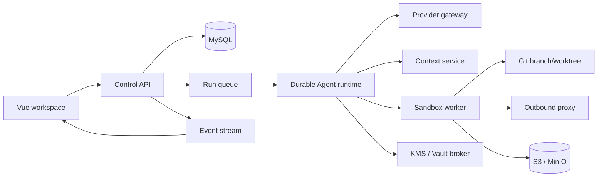
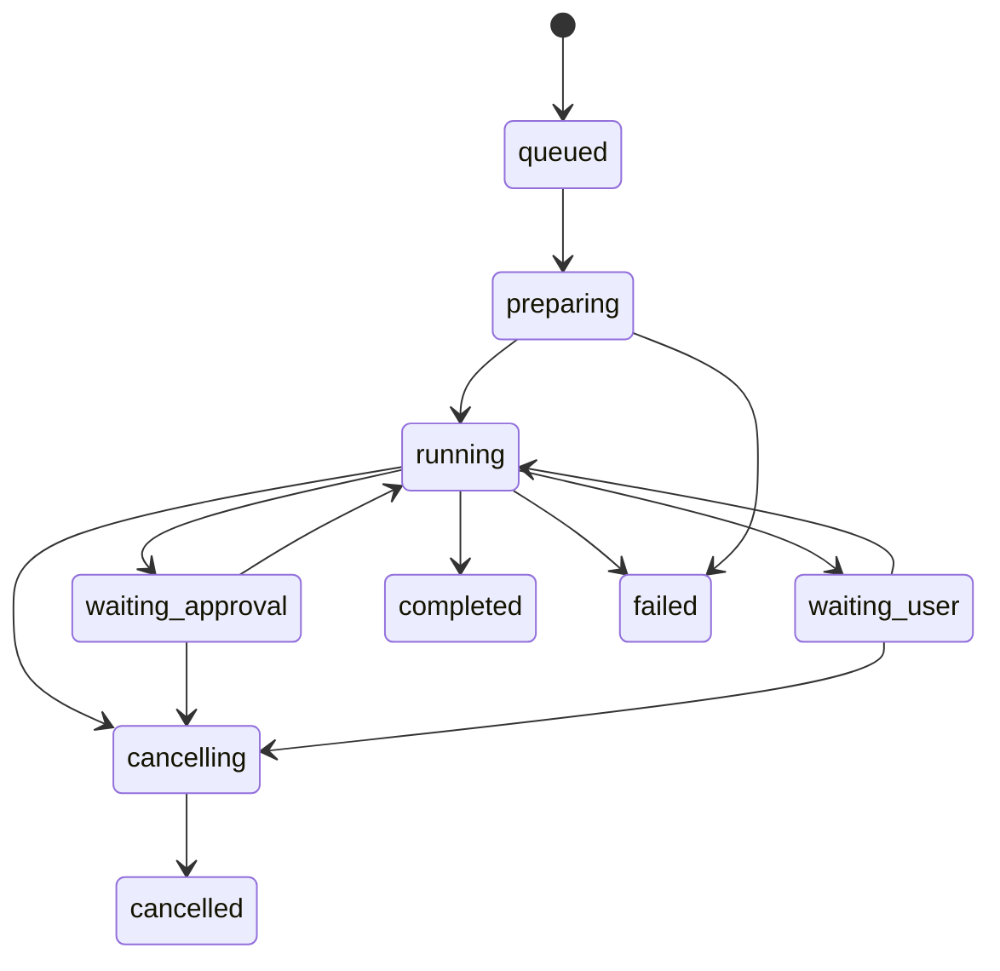

# LabexAgent Industrial Coding Agent Architecture

**Status:** Target architecture  
**Date:** 2026-07-10  
**Requirements:** [requirements.md](./requirements.md)  
**Implementation:** [implementation plan](../superpowers/plans/2026-07-10-coding-agent-industrialization.md)

## 1. Decision Summary

LabexAgent will evolve through a hybrid architecture:

- The existing Spring Boot application remains a modular control plane during the migration.
- All untrusted code execution moves to a separately deployable sandbox worker.
- Agent execution becomes a persisted state machine driven by events instead of a long-lived Java thread.
- Git branches/worktrees hold active source state; MySQL holds control state; S3/MinIO holds immutable artifacts; KMS/Vault holds secrets.

This provides a practical route from the current single-server product to a full cloud Agent without prematurely splitting every package into a network service.

## 2. Architecture Options Considered

### Option A: Local-first desktop runtime

The UI and Agent execute on the developer machine. This minimizes infrastructure cost and resembles local coding assistants, but it does not meet the requested multi-user server goal and makes centralized policy difficult.

### Option B: Cloud control plane with sandbox runners

The server owns identity, tasks, policies, and events. A local, self-hosted, or cloud worker owns each isolated workspace. This is the selected architecture because it supports the current product while introducing the most important security boundary first.

### Option C: Per-task managed virtual machine

Every run receives a disposable VM or micro-VM with desktop and browser automation. This provides the strongest isolation and richest verification, but has the highest scheduling, image, snapshot, and cost complexity. The worker contract will allow this backend after container execution is stable.

## 3. System Context



## 4. Deployment Units

### 4.1 Control API

The first deployment remains the existing Spring Boot service, split internally into the following modules:

- `identity`: authentication, ownership, organization policy, and audit actor.
- `project`: repositories, project metadata, environment templates, and access control.
- `run-api`: create, inspect, answer, approve, cancel, retry, and stream runs.
- `agent-runtime`: pure state transitions and orchestration ports.
- `provider-gateway`: provider adapters and normalized streaming events.
- `workspace-control`: leases, expected versions, branches, and change metadata.

Controllers remain thin. Runtime code cannot directly use `SseEmitter`, `ProcessBuilder`, the filesystem, or provider-specific JSON.

### 4.2 Durable Agent Runtime

The runtime is represented by persisted state plus an append-only event stream. MySQL is sufficient for the first implementation, using a transactional outbox and a worker queue. Redis Streams or RabbitMQ can deliver runnable steps; Temporal is an optional later replacement if runs become multi-day workflows.

The state machine is:



Every transition has `run_id`, `sequence`, `step_id`, `state`, `event_type`, `payload`, `created_at`, and an idempotency key. SSE is a projection of stored events, not the owner of execution state.

### 4.3 Sandbox Worker

The worker exposes a narrow protocol:

```text
prepareWorkspace(runSpec) -> workspaceVersion
execute(commandSpec, cancellationToken) -> executionResult
readFile(path, expectedVersion?) -> fileResult
applyChange(changeSpec, expectedVersion) -> newVersion
collectArtifacts(filter) -> artifactRefs
terminate(runId) -> terminationResult
```

The initial backend uses Docker or another OCI runtime. The boundary must support gVisor, Kata Containers, or Firecracker later without changing Agent logic.

Default policy:

- Read/write only inside the checked-out workspace and run temp directory.
- No control-plane environment inheritance.
- Read-only root filesystem where the language toolchain permits it.
- CPU, memory, PID, disk, output, and wall-clock limits.
- Network disabled unless a domain policy is attached.
- Complete process-tree termination on timeout or cancellation.

Interactive terminals connect to the same project worker. The server derives the workspace from the authenticated `userId` and `projectId`; `cwd` is workspace-relative and cannot select a host path.

### 4.4 Workspace and Change Service

Each mutating run receives a dedicated branch/worktree. A lease prevents two writers from operating on the same checkout. File changes use the following contract:

```text
relativePath
expectedSha256
newContentSha256
changeType
runId
stepId
```

The worker rejects writes when `expectedSha256` does not match the current file. Git generates diffs and rename detection. Conversation checkpoints and file checkpoints are stored separately so users can rewind either dimension.

The existing hidden snapshot repository is retained only during migration. Its shared index must not be used concurrently by multiple runs.

### 4.5 Provider Gateway

Provider adapters emit a normalized stream:

```text
response.started
reasoning.delta
text.delta
tool_call.started(callId, index, name)
tool_call.arguments.delta(callId, index, bytes)
tool_call.completed(callId, index, arguments)
usage.updated
response.completed
response.failed
```

Each adapter declares capabilities such as streaming, parallel tool calls, reasoning fields, image input, prompt caching, maximum context, native cancellation, and usage reporting. The gateway owns connection pooling, deadlines, retry classification, provider error sanitization, token accounting, and cancellation propagation.

### 4.6 Context Service

The context service maintains versioned repository knowledge:

- File metadata and content hashes.
- Tree-sitter or LSP symbols and references.
- Routes, tests, manifests, and build commands.
- Lexical BM25 index for identifiers and text.
- Optional embeddings for natural-language retrieval.
- Recent edits, diagnostics, failures, and accepted decisions.

Retrieval is hybrid and explainable. It returns path, line range, repository version, component scores, and selection reason. A token-budget allocator chooses repository context without repeatedly rebuilding a 24K-character digest.

### 4.7 Secrets and MCP

Database rows store encrypted values or secret references, never reusable plaintext credentials. Envelope encryption uses a KMS-managed key; local development may use a documented development key provider.

HTTP MCP is preferred. The control-plane broker attaches credentials after the Agent selects a permitted server, so credentials never enter the worker or model context. Stdio MCP runs inside the sandbox and receives only its explicitly configured environment.

### 4.8 Artifact Service

Object storage is used for immutable or append-only outputs:

- Full command logs beyond the model-visible truncation limit.
- Compressed workspace snapshots when no Git remote exists.
- Screenshots, videos, test reports, coverage, and build outputs.
- Exported patches and run diagnostics.

Active compilation does not run against object storage. A worker restores a snapshot to local disk, performs the run, then uploads selected artifacts.

## 5. Trustworthy Execution Contract

Every process result contains:

```json
{
  "status": "succeeded|failed|timed_out|cancelled|infrastructure_error",
  "exitCode": 0,
  "durationMs": 1200,
  "stdoutArtifact": "artifact://...",
  "stderrArtifact": "artifact://...",
  "modelOutput": "bounded combined output",
  "truncated": false
}
```

Only `status=succeeded` and `exitCode=0` can satisfy an executable verification requirement. Diagnostics may define their own success contract but must not infer success from the existence of output.

Output is drained concurrently while the process runs. Timeout or cancellation kills descendants, waits for termination, finalizes logs, and returns the corresponding non-success status.

## 6. Cancellation and Approval

A cancellation token is created per run and propagated through provider calls and worker commands. The client aborts its current stream and posts an idempotent cancellation request. The runtime persists `cancelling`, asks the provider and worker to stop, then persists `cancelled` after termination or a bounded cleanup deadline.

Approval and user-question requests are persisted records. Waiting suspends the state machine; it does not block an executor thread. Answers are authorized against user, project, run, and request IDs.

## 7. Security Boundaries

- The browser is untrusted.
- Model output and tool arguments are untrusted.
- Repository files, instructions, MCP responses, and web pages can contain prompt injection.
- The control plane is trusted for authorization but does not execute repository code.
- The worker is disposable and treated as potentially compromised.
- The outbound proxy prevents direct access to metadata, control-plane, tenant, and private-network services.
- Secret injection is scoped by run, tool, destination, and expiry.

Path validation resolves the workspace root and every existing path component without following unapproved links. Creation validates the nearest existing ancestor. Redirects and DNS resolution are revalidated for every outbound hop.

## 8. Data Ownership

| Data | System of record | Retention |
|---|---|---|
| Users, projects, policies | MySQL | Product policy |
| Runs, steps, events, approvals | MySQL | Configurable audit policy |
| Source code | Git remote | Repository policy |
| Active checkout | Worker-local disk/volume | Run or warm-environment lifetime |
| Logs and verification artifacts | S3/MinIO | Configurable artifact policy |
| Secrets | KMS/Vault | Secret policy |
| Search index | Rebuildable index store | Repository-version lifetime |

## 9. Migration Strategy

1. Correct tool success semantics and add execution contract tests.
2. Bind terminal sessions to authorized projects and scrub subprocess environments.
3. Introduce a worker interface while retaining an in-process development implementation.
4. Move shell, terminal, tests, code execution, LSP, and stdio MCP behind the worker.
5. Persist run events and replace blocking approval waits with resumable transitions.
6. Add workspace leases and compare-and-swap writes, then replace positional diffs with Git diffs.
7. Replace repeated scanners with the incremental context service.
8. Add native provider adapters and normalized multi-tool-call streaming.
9. Add background branches, pull-request delivery, browser artifacts, and real subagents.

At every step, old APIs remain available until the frontend has migrated and contract tests pass.

## 10. Public Design References

- Claude Code permission modes, sandboxing, checkpoints, and isolated subagent context.
- GitHub Copilot cloud agent ephemeral environments, branch/PR delivery, logs, hooks, and execution limits.
- Cursor cloud agent isolated VMs, encrypted secrets, outbound policy, artifacts, and credential-brokered HTTP MCP.
- Cline Plan/Act task sizing and independent code/conversation checkpoint restore.

These references describe public product behavior. This document does not assume undisclosed vendor internals.

