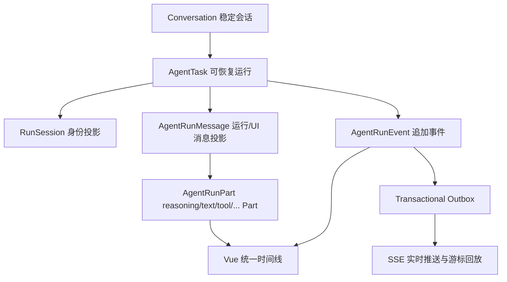

# LabexAgent OpenCode 运行时对齐状态

**状态：** 主要事实源已收敛（durable transcript / compaction epoch / 生命周期状态机）；Token 账本与缓存遥测已统一（2026-08-14）；剩余差异以平台与控制面边界为主，不是第二事实源
**初始验收日期：** 2026-07-28
**审计修订日期：** 2026-08-13（本次修订把 2026-07-29 记录的“模型 transcript 尚未收敛 / 压缩尚未收敛”更新为已收敛状态，证据见第 8 节）；**2026-08-14**（统一 Token 估算、DeepSeek 缓存遥测口径、存储层全量落库，证据见第 8 节 Phase 0）
**参考实现：** [sst/opencode](https://github.com/sst/opencode) `packages/opencode` **版本 1.17.4**（本地目录 `D:\opencode\opencode-dev`），具体文件：`session/prompt.ts`、`session/processor.ts`、`session/compaction.ts`（早期阶段还对照过 `tool/shell.ts`、`shell/prompt.ts`）
**引用方式：** **design reference only** —— 仅迁移设计不变量（Java/Vue 重实现），未复制任何 OpenCode 源码；许可记录见仓库根目录 `THIRD_PARTY_NOTICES.md`。若将来复制实质代码，必须按 MIT License 附带版权声明。

## 1. 结论

LabexAgent 已完成主要事实源收敛：

- 每次 Provider 请求由 `AgentTranscriptProjectionService.loadProviderMessages(taskId)` 从 durable `AgentRunMessage` / `AgentRunPart` + 最新 compaction epoch 重建；`AgentLoopEngine` 不再维护跨迭代的权威本地 `msgs` 列表（`providerMessagesForInvocation` 附加的 runtime projection 标注 `derived_read_only`，只用于当轮调用，不写回 transcript）。
- 上下文压缩持久化为 `AgentCompactionRecord`：previous summary、compacted head、retained tail、tail start、retained turns、source max sequence/task、token 预算与 epoch，`running/completed/failed` 终态幂等写入，重启后 `projectLatest` 可重建投影。
- assistant tool_calls 与 role=tool 的 `tool_call_id`/`name` 一一对应；孤儿 tool result 与缺失交互 tool call 均 fail closed。
- context overflow 采用有限策略序列（compaction → 工具 schema 缩减 → 显式终态停止），不无限重试同一 prompt。

仍保留的差异是平台与控制面边界（见第 9 节），不构成第二套 transcript、task status、approval waiter 或上下文摘要。
## 2. 当前状态模型



数据库新增：

- `t_agent_run_message`
- `t_agent_run_part`

`active-task` API 同时返回：

- `runSession`
- `runMessages`
- `parts`
- 兼容旧前端的 `toolCalls`

前端优先恢复 `runMessages` 和 `parts`，旧 `toolCalls` 只作为兼容投影。

## 3. Tool Part 生命周期

原生工具调用遵循稳定身份：

```text
pending -> running -> completed
                   -> error
                   -> waiting_approval -> completed / error
                   -> environment_blocked
pending/running    -> skipped / interrupted
```

关键约束：

1. Provider 在同一轮返回多个 `tool_calls` 时，全部保留并按 `toolCallIndex` 排序。
2. 同一 assistant turn 的所有 Tool Part 先持久化，再确定性串行执行。
3. 文件写入、命令审批和用户交互不并发执行，避免竞态和重复副作用。
4. 某个工具进入审批、环境阻塞、用户等待或循环保护后，同批次剩余工具明确转成 `skipped`，不允许永久停在 `pending/running`。
5. 命令批准、拒绝、过期、执行成功、执行失败和执行中断都会关闭原 `toolCallId` 对应的 Part。
6. 进程重启会把无法继续的开放 Part 封口为 `interrupted`，防止刷新后永久转圈。

## 4. 模型协议

`AgentModelTurnExecutor` 负责 Provider 能力协商、流式拼装、超时、取消和原生工具调用身份；主循环不再截断第二个及后续工具调用。

模型上下文使用 OpenAI-compatible 原生消息：

```json
{
  "role": "assistant",
  "content": "",
  "tool_calls": [
    {
      "id": "call-1",
      "type": "function",
      "function": { "name": "read_file", "arguments": "{}" }
    }
  ]
}
```

工具结果使用：

```json
{
  "role": "tool",
  "tool_call_id": "call-1",
  "name": "read_file",
  "content": "..."
}
```

文本中恢复工具调用仍保留为兼容兜底，但不是原生 Provider 的主要执行路径。

## 5. 可恢复语义

所有恢复入口统一从 `t_agent_task.request_payload` 恢复原始任务目标，并叠加本次恢复信息：

- checkout 等待恢复；
- 模型自动重试；
- 过期执行租约接管；
- 用户问题/权限交互恢复；
- 一次性命令审批恢复；
- 用户确认环境恢复。

恢复请求会保留：

- 原始 `message`；
- `conversationId`；
- `sessionId`；
- `taskId`；
- `activePath`；
- `modelConfigId`。

`waiting_workspace` 是可恢复暂停态，不再发送伪终态 `FINAL/DONE`。前端在初始 HTTP 流关闭后自动切换到同一 `taskId` 的持久事件订阅，等待 scheduler 恢复。这样不会出现后端已经继续执行、页面仍停在“等待工作区”的分裂状态。

## 6. 前端身份与回放

前端任务恢复同时校验：

- `conversationId`
- `sessionId`
- `taskId`
- subscription generation

即使 `conversationId` 相同，只要用户已经创建了新的 `sessionId`，旧任务事件也不能写入新会话 UI。

Tool Part 可视状态包括：

- running
- completed
- waiting_approval
- warning / environment_blocked
- skipped
- interrupted
- error

刷新后不会把 `skipped` 或 `interrupted` 重新显示为运行中。

## 7. 处理器拆分

`AgentLoopEngine` 仍是兼容入口，但以下职责已拆成独立 Spring 服务：

- `AgentModelTurnExecutor`
- `AgentToolTurnExecutor`
- `AgentToolCallBatchProtocol`
- `AgentToolNarrator`
- `ToolSelectionPolicy`
- `ContextAdmissionService`
- `ContextAdmissionGate`
- `AgentInteractionPauser`
- `AgentTranscriptProjectionService`（Provider 输入的唯一读取入口）
- `AgentRunTranscriptService`（Provider message/part 持久化边界）
- `AgentCompactionService`（compaction epoch 持久化）
- `AgentRunProgressProjectionService`（工程进度派生投影）

## 8. 验收证据

### 2026-08-13 修订（durable transcript / compaction 收敛复核）

T2.3 聚焦测试集全 PASS（75+ tests）：

- `AgentTranscriptProjectionServiceTest`(5) / `AgentTranscriptProjectionContractTest`(1) / `AgentRunTranscriptServiceTest`(17)
- `AgentCompactionServiceTest`(9) / `CompactionSelectionTest`(2) / `AgentConversationCompactionServiceTest`(5)
- `AgentLoopEngineContextBudgetTest`(9) / `AgentLoopEngineCompactionTerminalityTest`(4) / `AgentLoopEngineDurableCompactionWiringTest`(2)
- `TurnAwareContextPrunerTest`(3) / `ContextBudgetResolverTest`(5) / `AgentContextTranscriptBoundaryTest`(1)
- `AgentRunProgressProjectionServiceTest`(4) / `CompactionAgentTest`(3) / `AgentConversationTranscriptProjectionServiceTest`(4)

对照 OpenCode `session/prompt.ts`、`processor.ts`、`compaction.ts` 复核结论：

1. 每轮 Provider 从 durable projection 重建（`providerMessagesForInvocation` → `loadProviderMessages`），本地列表只是当轮派生只读投影。
2. tool call/result 一一对应；孤儿 tool result、缺失交互 tool call、未完成 tool batch 均按协议 fail closed 或截断。
3. compaction 持久化 summary/head/tail/turn 数/epoch/source boundary/token 预算；previous summary 复用；restart 可解释重建。
4. recent tail 从真实 user turn 计算（默认 tailTurns=2，preserveRecent=clamp(25%, 2000..8000)，与 OpenCode 一致）。
5. prune 只清除历史 completed tool result（内存投影层面清除，durable Part 保留原文；保护 write/plan/test/question/permission 工具）。
6. context overflow 走有限策略序列并显式终态停止。

### 2026-08-14 Phase 0（统一 Token 账本与缓存遥测）

对照 OpenCode `session/session.ts getUsage`（cache read/write 归一化）、`packages/llm/src/protocols/openai-chat.ts`（usage 提取）、`core/src/util/token.ts`（估算只服务预算）复核结论：

1. **单一估算器**：`AgentRequestTokenEstimator`（UTF-8 字节/3 + 每消息 4 + 请求 12 信封）是唯一 token 估算实现；`ContextUsageEstimator`、CONTEXT_STATS、provider 无 usage 兜底全部委托同一实现。仓库内已无 `length()/3`、`length()/4` 重复公式（grep 证据）。
2. **权威二分**：provider usage 是 UI/落库/溢出的唯一权威；估算只用于 admission 门禁与压缩触发，且 TOKEN_USAGE 事件带 `estimated=true` 标注。
3. **DeepSeek 官方字段**：`extractUsage` 认 `prompt_cache_hit_tokens / prompt_cache_miss_tokens`（api-docs.deepseek.com 口径：`prompt_tokens = hit + miss`）；miss 计入 cache write，`write_only` 状态首次可真实触发。
4. **命中率口径**：`CacheTelemetry.hitRate` 为 miss-aware（`cached/(cached+miss)`，无 miss 字段回退 `cached/prompt`）；前端显示 cache read/write/非缓存 input token 账本，百分比标注“会话级”。
5. **存储层全量**：`AgentRunMessage.content` 与 `AgentRunPart.output_text` 持久化不再截断（LONGTEXT）；截断只属于请求构建期准入/压缩与展示层。`t_agent_token_usage` 新增 `cache_hit_tokens / cache_miss_tokens`（additive 迁移）。
6. **验证**：后端全量 1576 tests 0 failures；前端 249 tests 全过；`UsageExtractionDeepSeekTest`（fixture 四件套）与 `TokenAccountingConvergenceTest` 红→绿。

### 2026-07-28 已完成

- 后端全量：710 tests，0 failures，0 errors，7 skipped；
- 前端全量：138 tests，全部通过；
- Vite production build 和 chunk budget 通过；
- 隔离后端重启验收通过：问题、权限、命令批准/拒绝、checkout 竞争、压缩、上下文阻塞、完成证据、未验证改动拦截；
- 隔离浏览器验收通过：桌面三栏、会话隔离、刷新去重回放、SSE cursor、上下文卡片、完成证据；
- 浏览器验收 0 console errors、0 network errors；
- `active-task` 真实 API 验证 `runSession / runMessages / parts` 非空且身份一致，`RunPart.messageId` 有效；
- 当前开发后端已于 2026-07-28 18:40 重启并加载新 class。

## 9. 与 OpenCode 仍存在的差异

1. **平台差异**：OpenCode 是 TypeScript/Bun 运行时；LabexAgent 是 Spring Boot + Vue，不能照搬文件或 API，只能迁移不变量。
2. **控制面差异**：LabexAgent 已有 JWT、项目归属、MCP 管理和沙箱审批，这些边界必须保留，不能为了“模仿 OpenCode”而绕开。
3. **模型 transcript 已收敛**（2026-08-13 修订）：Provider 历史由 durable projection 生成；本地列表只作为同轮派生只读投影。
4. **上下文压缩已收敛**（2026-08-13 修订）：`AgentCompactionRecord` 提供 previous summary + compacted head + recent tail + epoch + source boundary 的可审计记录；旧 checkpoint/summary 兼容投影仍在收敛计划中按顺序下线。
5. **生命周期写入基本收敛**：状态写入收束到 `AgentRunLifecycleService` 与显式迁移键；仍需监控是否有服务绕过直接改 status。
6. **Token 预算已收敛**：模型窗口、工具定义、系统提示、历史、输出预留统一估算；未知模型不得以 1M 作为宽松默认值。**（2026-08-14 修订）估算器已收敛为单一实现，UI/门禁/压缩触发同源。**
7. **Provider 协议层已补强**：`AgentProviderMessageProjector` + `AgentProviderProtocolValidator` 校验 `tool_call_id` / `name` 完整性，发送前 fail fast。
8. **真实外部 Provider 验收仍取决于用户配置**：不读取或暴露密钥；没有用户配置时只能做 fake provider、协议和故障注入验证。
9. **工业化能力仍有差距**：并发隔离、队列、限流、审计、失败分级、指标看板、灰度和灾备仍需独立建设。
10. **上下文懒加载未对齐（2026-08-14 记录）**：首条消息仍预注入 ~60k 字符的 session_context bundle（adaptive 索引/repo map/memory/诊断），openCode 是工具按需拉取；对应计划 `2026-08-14-opencode-context-token-cache-alignment` Phase 1。
11. **缓存前缀纪律部分对齐（2026-08-14 记录）**：静态工具定义尚未按 name 显式排序；system prompt 仍重复注入 tools 文本清单；对应计划 Phase 2。
12. **prune 仍不可达（2026-08-14 记录）**：`TurnAwareContextPruner` 仍无生产调用方（`hasPrunableToolResult=false` 硬编码）；对应计划 Phase 3。

### 未完成项（2026-08-13 更新）

- Linux Web 生产部署（计划 T3.1–T3.4）：生产配置 fail-fast、Docker Worker image、Nginx/Caddy 反代、真实 Linux 全链路 smoke 均未验收。
- 交互式 WebSocket PTY 未恢复；REST managed terminal 是当前唯一可用终端路径。
- 多用户并发隔离、限流、配额、备份恢复、监控告警未建设。
- 真实外部 Provider 的端到端验收取决于用户配置（当前仅有 fake provider、协议与故障注入证据）。
- 旧 `checkpoint/summary` 兼容投影仍在观察期，达到删除条件后按 `LABEX_AGENT_LEGACY_REMOVAL_VERSION` 移除。
- **上下文/Token/缓存对齐剩余阶段（2026-08-14 计划）**：Phase 1 上下文瘦身（首条消息拆解、工具按需拉取、删 system tools 文本清单）→ Phase 2 前缀稳定化（工具排序）→ Phase 3 压缩/裁剪（溢出优先触发、锚定摘要、prune 修通）→ Phase 4 指令就近附着 + 工具输出截断对齐 truncate.ts → Phase 5 subagent 隔离（仅设计）。计划文档：`docs/superpowers/plans/2026-08-14-opencode-context-token-cache-alignment/`。
## 10. 不变量清单

- 同一个事实只能有一个权威所有者：内存 `msgs`、SSE 连接、前端状态和文本 summary 都不能成为权威运行事实。
- 每次 Provider 请求必须能由持久化 Message/Part 的 projector 重建；本地缓存只能是派生加速层。
- 裁剪或压缩不得破坏 `assistant.tool_calls` 与 `role=tool`、`tool_call_id`、`name` 的协议对应关系。
- 每次压缩必须持久化 previous summary、head/tail 边界、epoch 和状态，重启后能解释并重建。

后续修改不得破坏：

- 新会话不能读取或渲染旧 session 的事件；
- 可恢复暂停不能发送终态 `DONE`；
- 恢复请求不能覆盖原始用户目标；
- 每个原生工具调用必须有稳定 `toolCallId`；
- 每个 Tool Part 必须有明确终态或可恢复等待态；
- 审批只执行一次，结果必须回写原 Tool Part；
- SSE 断开不等于任务完成；
- 完成声明必须有持久化验证证据；
- 当前 JVM 启动时间必须晚于所验证 class 的构建时间，才能宣称运行时已加载修复。
