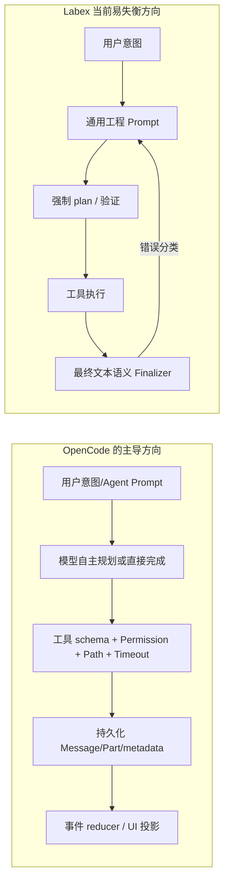
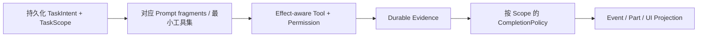

# OpenCode Harness 深度对比：LabexAgent 的过严与过宽控制面

- **研究日期：** 2026-08-15
- **OpenCode 参考快照：** `D:\opencode\opencode-dev`，`packages/opencode/package.json` 标注版本 `1.17.4`
- **研究方法：** 仅使用两边的本地一手源码和 LabexAgent 的真实运行日志；未复制 OpenCode 实质代码。
- **触发样本：** `D:\LabexAgent\workspaces\279\2dd6a6b8ebd2489493be3e38cd843e00\workspace\.labex\agent-logs\20260816-005930-67752bc0-f05d-4207-b607-cf281e0551d7.md`

> 说明：触发样本的文件名和正文记录为 **2026-08-16**，相对于本研究日期 **2026-08-15** 属于未来日期。这是运行环境/日志时钟不一致问题；它不改变本研究的控制流结论，但会干扰事件排序、TTL 与恢复诊断。

## 1. 结论

LabexAgent 当前最核心的问题不是“工具不够多”，也不只是“模型幻觉”，而是控制面出现了反向失衡：

> **在意图、计划和最终答复上过度替模型作语义裁决；在真正有副作用的命令、依赖安装、网络与工具集暴露上又过于宽松。**

OpenCode 的成熟形态不是“更强地控制模型做每一步”，而是：

1. **让模型决定如何完成正常任务**：是否需要 Todo/Task、何时结束、是否值得验证，默认不把每次操作包装成工程交付；
2. **把硬约束放到动作边界**：工具 schema、权限模式、路径范围、命令解析、取消、输出截断和持久化 Part；
3. **把状态作为可回放事实，而不是根据最终自然语言反推事实**：工具结果、权限请求、消息 Part、快照和事件各有明确所有者；
4. **只在局部事实足以判定时阻止动作**，不以全局字符串规则否决正常回答。

LabexAgent 已具备更适合多用户 Web 的 durable transcript、epoch/lease、outbox/SSE 回放和 workspace 隔离能力；这些不应该后退。需要收敛的是 **Task Intent / Scope / Effect / Evidence** 四个层面的契约，而不是继续加更强的全局 prompt 或字符串 guard。

## 2. OpenCode 的整体 Harness 设计

### 2.1 Prompt 是模型适配与行为引导，不是全局工作流状态机

OpenCode 按模型选择 provider prompt：

- `D:\opencode\opencode-dev\packages\opencode\src\session\system.ts:25-38` 按模型 ID 选择 default/GPT/Codex/Claude/Gemini 等 prompt；
- `D:\opencode\opencode-dev\packages\opencode\src\session\system.ts:55-91` 只注入工作目录、worktree、Git 属性、平台和显式 project references；
- `D:\opencode\opencode-dev\packages\opencode\src\session\instruction.ts:122-168` 以“首个项目指令文件优先 + 显式配置指令”的方式加载项目 instructions，避免祖先目录无限叠加。

默认 prompt 的关键取向：

- `...\session\prompt\default.txt:53-58`：允许主动完成用户请求，但强调不要采取让用户意外的附加动作；
- `...\session\prompt\default.txt:70-76`：对软件工程任务建议搜索、实现、**尽可能**验证；不把 plan/test 设为每个任务的硬性完成前置；
- `...\session\prompt\codex.txt:42-49`：短任务默认可直接执行；只有会实质改变结果、不可安全推断或涉及破坏/生产/密钥的歧义才提问。

这意味着：OpenCode 的 Todo/Task 是模型可用的协作工具，不是一个会阻止“下载成功”回答的全局门槛。

### 2.2 主循环以持久化消息/Part 的完成状态为退出依据

- `D:\opencode\opencode-dev\packages\opencode\src\session\prompt.ts:1141-1182`：循环重新读取持久化消息；当最后 assistant turn 已 finish、没有待执行 tool call，且在 user turn 之后时直接退出；
- `...\session\prompt.ts:1214-1221`：context overflow 触发的是 compaction task，不是重写用户任务语义；
- `...\session\prompt.ts:1231-1233`：最大步骤数是 agent 配置 `agent.steps`，未配置时为 `Infinity`；达到上限时在 `...\prompt.ts:1343` 注入只允许文本收尾的明确提示；
- `D:\opencode\opencode-dev\packages\opencode\src\session\message-v2.ts:74-133`：cursor、Message、Part 从数据库排序并 hydrate；
- `D:\opencode\opencode-dev\packages\app\src\context\global-sync\event-reducer.ts:182-339`：前端只依据 session/message/part/permission 事件做 reducer 更新。

**关键差异：** OpenCode 不会因为 final text 包含一个普通 GitHub URL，就把一个已完成的下载任务重新送回模型要求解释 preview。它的 loop 退出关注 assistant/tool Part 的完成关系，而不是全局扫描最终自然语言中的 URL。

### 2.3 权限位于工具执行边界，并按具体 pattern 询问

- `D:\opencode\opencode-dev\packages\opencode\src\permission\index.ts:39-48`：规则没有命中时默认返回 `ask`，不是 allow；
- `...\permission\index.ts:78-117`：针对本次 permission + pattern 逐项评估，deny 立即拒绝，ask 发布持久化/可消费事件并等待 reply；
- `D:\opencode\opencode-dev\packages\opencode\src\tool\shell.ts:257-297`：Shell 先解析 Bash/PowerShell AST，提取命令涉及的目录和 pattern，再申请对应权限；
- `...\tool\shell.ts:552-605`：exit、timeout、abort、截断与完整输出位置作为工具 metadata 返回；
- `D:\opencode\opencode-dev\packages\opencode\src\session\tools.ts:41-72`：每次工具执行带稳定 session/message/call 身份，并经统一 permission service；
- `...\session\tools.ts:117-201`：MCP tool 同样经过 permission，输出再统一截断并附 metadata。

OpenCode 也允许用户通过配置放宽策略，且它的 pending permission 在单机 `InstanceState` 内，并不适合原样搬到多用户 Web；但其“默认 ask、按 effect/pattern 判断”的方向比 Labex 当前 build 全放行更接近正确的安全边界。

### 2.4 工具结果只陈述已发生的事实

OpenCode Shell 并不把“非零退出”偷换成“Worker 崩溃”：`...\tool\shell.ts:552-605` 明确区分 exit/abort/timeout，保留 exit 与 output metadata。`grep.ts:10-107` 与 `read.ts:229-340` 则把路径、截断、行窗口和结果 metadata 作为局部工具事实。

LabexAgent 已在本轮对 `grep.path`、`read_file` 缺失路径恢复、shell `outcome=non_zero_exit` 做了同方向收敛；这是应该继续保持的层面。

### 2.5 Snapshot 和 UI 都是动作后的事实投影

- `D:\opencode\opencode-dev\packages\opencode\src\snapshot\index.ts:234-297`：只对 Git diff/untracked 候选进行安全筛选和 stage，作为变更快照基础；
- `...\app\src\context\global-sync\event-reducer.ts:228-295`：Part update/delta/remove 是 UI 投影，不反过来决定 session 是否完成。

## 3. LabexAgent 当前形态与真实日志交叉验证

### 3.1 已经对齐、应保留的能力

现有对齐状态文档 `D:\LabexAgent\docs\coding-agent-industrialization\opencode-alignment-status.md` 记录：durable `AgentRunMessage` / `AgentRunPart`、compaction epoch、task lifecycle、outbox/SSE 回放与多 tool call 顺序已经成为当前核心方向。

源码也支持这一判断：

- `D:\LabexAgent\backend\src\main\java\com\labex\labexagent\run\AgentRunMessageService.java:18-132`：Run Message 持久化并提供 history 投影；
- `D:\LabexAgent\backend\src\main\java\com\labex\labexagent\run\AgentRunPartService.java:180-229`：loop guard、finalization blocker、model step、interaction、recovery 与 lifecycle 都可投影为 durable Part；
- `D:\LabexAgent\frontend\src\composables\agentHistoryReducer.js:83-176` 与 `...\useConversationState.js:216-294`：前端能将历史事件、run message 和 Part 重放为同一时间线；
- workspace path 和 execution epoch/lease 是多用户 Web 控制面必须保留的防线，不能按 OpenCode 单机假设简化。

### 3.2 触发日志的控制流

真实样本中，用户只要求“找到类似 superpowers 的 GitHub 插件并下载本地”，但运行扩展为 27 个 iteration：

1. 搜索后模型创建三步 persistent plan；
2. clone 成功、目录存在、`git status` 和技能数量已经验证；
3. 第 6 轮 `create_plan(action="complete")` 被拒绝为 `verification_missing / generic`；
4. 模型为满足这个 harness 门槛连续运行 `run_tests`；
5. 测试缺 `ws` 后，模型进一步安装依赖并重跑——这是用户未要求的副作用；
6. 最终总结仅包含 GitHub Markdown 链接，却被 finalizer 拒绝为 `preview_not_ready`；
7. 第 27 轮被错误的 recovery prompt 驱动去解释“没有启动服务”。

该日志说明问题不是单一模型误判，而是多个 harness 规则串联后造成 scope drift。

## 4. 哪些地方过于严苛

| 问题 | Labex 当前证据 | 为什么会伤害任务完成 | OpenCode 对照 | 修复方向 |
|---|---|---|---|---|
| **所有工程任务强制 plan** | `LabexSystemPrompt.java:102-146` 要求 inspect/edit/run/verify 类任务先 `create_plan`，并把 plan 全完成列为 system-enforced completion condition | “搜索 + clone”被错误升级为工程交付；模型一旦建 plan 就进入状态机 | OpenCode default prompt 只说 Todo “if required”；Codex prompt 对短任务默认直接做 | 新增持久化 `TaskIntent`；仅复杂 code change 或用户要求计划时启用 durable plan |
| **完成必须有验证证据** | `LabexSystemPrompt.java:133-146` 强制 verification；`CreatePlanTool` 再在完成 task 时调用 evidence 判定 | clone 的退出码、目标目录、commit、git status 没有成为一等 completion evidence | OpenCode 按 assistant/tool Part 的完成关系退出，不解析“工程验收” | 按 intent 定义 success criteria；获取任务使用 acquisition evidence，不要求 run_tests |
| **字符串触发的 generic verification** | `PlanVerificationEvidenceService.java:169-203` 只要计划文本含“验证/verify/test/build…”就设为 required；`验证下载完整性`被归为 `GENERIC` | 一个自然语言标题变成控制面硬闸，模型只能想办法制造 `run_tests` | OpenCode 不把 Todo 文案反向解释为硬状态机语义 | Plan item 使用显式 `evidenceKind` enum；缺失时不阻塞，或只记录 warning |
| **最终文本被全局 URL 审查** | `PreviewClaimPolicy.java:23-43` 以 `!urls.isEmpty()` 判定 preview claim；`AgentRunFinalizer.java:51-57` 每次 final 都调用 | GitHub 文档链接被误当成 preview URL，已完成任务被重新打开 | OpenCode prompt 只禁止猜 URL；没有全局 final URL 证据门 | 仅把 loopback/configured preview host 或明确 preview claim 纳入校验；外部 URL 必须放行 |
| **循环保护只识别重复/无进展，不识别目标漂移** | `AgentLoopProperties.java:10-19` 默认 hard/soft total iteration 都可为 0；日志明确 `no fixed total iteration cap` | “每轮都有新工具/新测试”会被误当 progress，实际离用户目标越来越远 | OpenCode 也可能无上限（`agent.steps ?? Infinity`），不是自动更好 | 保留重复检测，但新增 per-intent effect/cost budget 与 scope-drift guard |
| **全局 prompt 过重** | `LabexSystemPrompt` 将语言、命令、workflow、memory、visibility、tool、completion 一次性合并 | 模型需要同时满足许多硬话术，简单任务更容易被强制流程淹没 | OpenCode 将 provider-specific prompt、environment、instructions 分层组合 | 按 task intent 选择 prompt fragments；不要把工程收尾规则注入所有任务 |

## 5. 哪些地方过于宽泛

| 问题 | Labex 当前证据 | 风险 | OpenCode 对照 | 修复方向 |
|---|---|---|---|---|
| **build/agent 默认全允许** | `DefaultPermissionRuleset.java:12-25` 第一条是 `*/* ALLOW`；只有少数 rm/del 模式改 ASK | `npm install`、`pip install`、`git clone`、任意网络下载或破坏性组合命令可能绕开明确确认 | OpenCode 无命中默认 `ask`，Shell 解析命令再申请 pattern permission | 用 effect-based 默认 deny/ask 替代 broad allow；至少 dependency install、network write、VCS remote、server start 默认 ASK |
| **工具名 deny 可以被 Shell 绕过** | `repo_clone` 被 deny（第 20 行），但 `shell "git clone ..."` 仍命中广泛 ALLOW | “禁止 repo_clone”不是“禁止 clone” | OpenCode 的 shell 在 shell parser / permission 层按命令结果分类 | 把 clone/installer/remote upload 等定义为 effect，不靠某个 tool 名称 |
| **explore mode 仍允许任意 shell** | `DefaultPermissionRuleset.java:64-87` 在 explore 列表末尾允许 `shell *`、`bash *` | 只读模式并非真正只读，模型可执行安装、写入、网络动作 | OpenCode 的 agent/session permission 与 tool 调用共同决定，未授权默认 ask | explore 默认只读；需要 shell 时只允许明确 allowlist 的只读命令，其他 ASK |
| **工具选择只看 mode/capability，不看任务意图** | `ToolSelectionPolicy.java:18-56` 依据 mode、image/MCP/web capability 选择；build 仍暴露全部静态工具 | 一个“下载仓库”任务可见 create_plan、run_tests、preview、task、MCP 等过多高成本工具 | OpenCode 也会按 agent/permission/user tool filter，但完整 tool set 仍可能很大 | 在现有 policy 上加入 `TaskIntent` 和 effect budget，形成最小工具集 |
| **AgentContext 承载过多语义派生状态** | `AgentContext.java:25-43` 同时持 plan、stage、network、unverifiedChanges、trusted verification、selected tools 等 | 很容易重新形成“内存状态与 durable state 谁说了算”的灰区 | OpenCode v1.17.4 自身也有 V1/V2 dual-write，不应神化 | 已持久化的 TaskScope/plan/evidence 应只读投影到 context；明确移除兼容期与所有者 |
| **初始化上下文可能超量** | `AgentContextManager.java:37-56` 会按模型大小加入 project digest、index、活动文件大块内容 | 研究/下载型任务本不需要项目代码图，浪费 token 并干扰模型 | OpenCode environment 注入很小，复杂内容用 Read/Task 按需获取 | intent=research/acquisition 时禁用 repo digest、active file 全文和 code-map 注入 |

## 6. 关键架构差异：把硬约束放在哪里



应当把 Labex 调整为：



原则：

- **用户意图决定可接受的副作用和完成证据；**
- **工具执行决定事实；**
- **最终自然语言只能陈述事实，不能成为重写任务状态的全局输入。**

## 7. 推荐的分阶段改造

### P0：立刻修正错误阻断和无授权副作用

1. `PreviewClaimPolicy`
   - 未启动 managed preview 时，普通外部 URL（GitHub、文档、API）必须允许；
   - 只有 loopback/configured preview host，或明确“服务已启动/可访问”声明，才要求 durable preview evidence；
   - 回归：本研究触发日志的 GitHub Markdown 链接 + `NOT_REQUESTED` 必须 permitted；`http://localhost:*` 无 READY 必须 rejected。
2. Shell 权限
   - 将 `npm install`、`pnpm install`、`pip install`、`cargo install`、`git clone/fetch/push`、下载执行链、server start 归为显式 effect；
   - 取消 build 模式 `*/* ALLOW` 的默认设计，至少上述 effect 默认 ASK；
   - `repo_clone` deny 不能被 `shell git clone` 绕开。
3. 最小作用域暂停
   - 当前 task 未声明安装/测试时，第一次 `dependency_install` 或 `server_start` effect 应持久化为 `waiting_approval`，而不是执行。

### P1：Task Intent 和 Completion Evidence

新增持久化 `TaskIntent` / `TaskScope`，建议最小集合：

| Intent | 默认允许 | 默认禁止或 ASK | 合法完成证据 |
|---|---|---|---|
| `CODE_CHANGE` | read/search/edit/test（按权限） | dependency install、preview、remote push 需 scope/approval | diff + targeted test/build/lint/readback |
| `WORKSPACE_ACQUISITION` | web search、受控 clone/download、目录/Git 检查 | dependency install、运行测试、启动服务、remote push | clone/download exit=0 + target exists + revision/status |
| `RESEARCH` | web/search/read | workspace write、shell mutation、install | 来源/检索结果 |
| `DIAGNOSIS` | read/search/限定命令 | 修改、安装、server start | 可复现实验或日志证据 |
| `CHAT` | 无工具或极少只读工具 | 所有副作用 | 文本回答 |

要求：

- `TaskScope` 创建时写入 `AgentTask` / Run Event，`AgentContext` 只能读取投影；
- 简单任务不能因为“可能是工程”自动进入 `create_plan`；
- plan item 使用显式 `evidenceKind` / `target` 字段，禁止从中文/英文标题 substring 推断硬约束；
- `run_tests` 只在 `CODE_CHANGE` 或用户明确要求时是默认 completion evidence。

### P2：最小工具集与预算

扩展 `ToolSelectionPolicy`：

1. 现有 mode + provider capability 过滤保留；
2. 再根据 `TaskIntent` 隐藏无关工具：下载任务不暴露 `create_plan`、`run_tests`、`start_preview`、`execute_code`、`task`，除非用户要求；
3. 引入配置化预算：
   - 最大工具调用数；
   - 最大网络读取数；
   - 最大 mutable effect 数；
   - 最大 dependency install 数（默认 0）；
   - 最大无用户新增目标数；
4. 超预算时产生 durable `scope_extension_required` interaction，而不是让模型靠更多工具“证明”自己。

这不是取代现有 `AgentLoopGuard`：重复调用/cycle guard 继续处理机械循环；Scope budget 处理的是本日志这种“每一步都不同、但任务目标已经漂移”的语义循环。

### P3：状态与投影收敛

- 将 `AgentContext` 中 plan、stage、selected tools、verification source、scope/evidence 改为来自 durable Task/Plan/Part 的只读投影；
- `AgentRunFinalizer` 只评估当前 `TaskScope` 声明的证据，不从 final text 广泛猜测要求；
- UI 新增 `scope_extension_required`、`effect_blocked`、`evidence_satisfied` Part 类型，但仍只消费服务端 durable event/part。

## 8. 验收用例

### 8.1 本次日志的端到端回归

输入：

```text
我记得 GitHub 上有一个非常类似 superpowers 的插件，帮我找到它，然后下载在本地。
```

期望：

- 若候选不唯一：先给 2–3 个候选或问一个问题；若选择 `obra/superpowers`，说明是假设；
- 最多：搜索 → clone/download → `git rev-parse` / 目录检查 → final；
- **不自动 create_plan，不自动 run_tests，不自动 npm install，不启动 preview；**
- 最终包含 GitHub 链接时 task 直接 completed，不能出现 `preview_not_ready`；
- 若模型尝试依赖安装，进入 `waiting_approval` 并展示原因。

### 8.2 工程改造不退化

输入：

```text
修复 frontend 登录表单的重复提交，并运行项目已有的针对性验证。
```

期望：

- 可创建持久化 plan；
- edit/write 后仍要求 diff/readback/目标 test；
- 测试失败不能被 shell 的 `outcome=non_zero_exit` 误标为成功；
- 断线/刷新后从 durable event/part 恢复。

### 8.3 Preview 保持严格

- 无 preview evidence：`http://localhost:3000` 或“服务已启动”被拒绝；
- READY public URL：精确 URL 允许；
- 外部 GitHub/document URL：不参与 preview claim 判断；
- 纯文本中提及“未启动预览/服务未运行”：允许作为诚实失败报告。

## 9. 不应机械复制 OpenCode 的部分

1. **外部目录读取**：OpenCode `read.ts:250-260` 可在 permission 后读取 workspace 外路径。Labex 是多用户 Web，应继续保持 `SecureWorkspacePath` 的 workspace 边界，不应放开；
2. **内存 pending permission**：OpenCode `permission/index.ts:57-117` 使用 InstanceState map。Labex 必须保留 durable interaction + epoch/lease 幂等恢复；
3. **无限步骤默认值**：OpenCode `agent.steps ?? Infinity` 说明它也可能长跑。Labex 不应照搬 Infinity，而应按 task intent 使用成本/副作用预算；
4. **OpenCode 自身仍有迁移兼容层**：`session/processor.ts:315`、`375` 标注 V1/V2 temporary dual-write。它不是可以逐行搬运的“完美架构”。

## 10. 最终判断

LabexAgent 的正确演进方向不是“更像一个严格的 CI gate”，而是：

> **像 OpenCode 一样把模型的常规任务自由度留在 prompt/agent 层；像多用户 Web 控制面一样，把真正危险、昂贵、可恢复、可审计的限制放在 durable scope、effect permission、tool part 与 evidence 层。**

对于当前最痛的“模型不听话、乱装依赖、乱跑测试、乱进入循环”，优先级应是：

1. 修 preview 外链误杀；
2. 拆掉“所有任务都必须 plan + verification”的全局硬门；
3. 建立 TaskIntent/TaskScope；
4. 用 effect-based permission 收紧 shell；
5. 用 scope/effect budget 补足只靠重复检测的循环保护。
