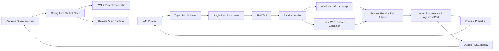
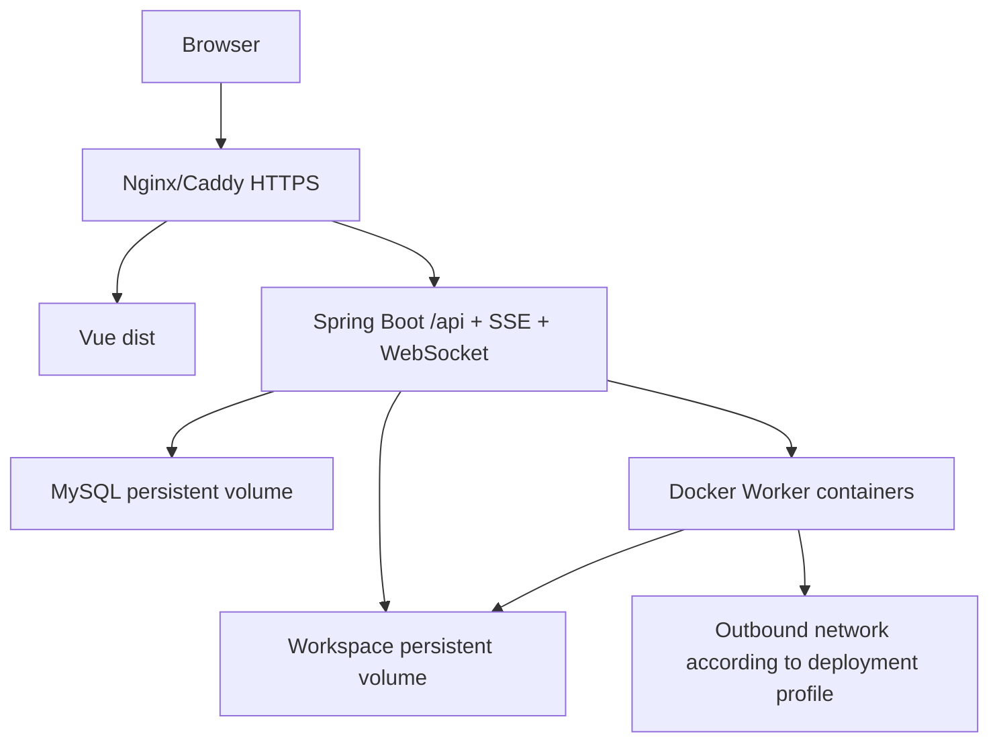

# LabexAgent OpenCode-First 可用性改造规格（spec.md）

**状态：** Phase 1 已完成；当前为 Local/WSL 执行层候选，Linux Web 未验收  
**制定日期：** 2026-08-12  
**适用仓库：** `D:\LabexAgent`  
**本地 OpenCode 参考快照：** `D:\opencode\opencode-dev`（`packages/opencode/package.json` 版本 `1.17.4`，MIT License）  
**关联计划：** [tasks.md](./tasks.md)  
**验收清单：** [checklist.md](./checklist.md)  
**现有状态收敛约束：** [Agent Runtime State Convergence Plan](../2026-07-29-agent-runtime-state-convergence.md)

> **2026-08-12 阶段状态：** 本轮已完成真实 Shell Contract、Worker Shell descriptor/factory、OpenCode 默认权限、结构化输出 artifact、动态提示词、WSL 真实 fixture 和后端重启/审批/compaction 验收。当前不能把这组证据等同于 Linux Web Ready：Docker daemon、Linux production、反向代理和浏览器真实流程仍未验证。
>
> **当前建议：** Windows 本地优先使用 WSL Worker；Linux 私有部署可以继续推进，但必须先完成 Phase 3 的 Docker + production + reverse proxy + browser 门禁。公网多用户不能使用宿主机 direct shell。


---

## 1. 背景与问题定义

LabexAgent 已经具备 Spring Boot + Vue Web 工作台、JWT、多项目工作区、模型配置、Tool、MCP、LSP、持久化 Message/Part、SSE 回放、审批和 Worker 等基础设施，但当前 Coding Agent 的首要失败不是“缺少安全控制”，而是**工具、提示词、执行器和模型习惯不匹配，导致模型无法完成真实开发闭环**。

当前最典型的问题：

1. `shell` 名义上是 Shell，实际上只接受一套自定义的受限 direct-command 语法。
2. `&&`、管道、重定向、引号、变量、子表达式等正常 Bash/PowerShell 语法会被提前阻止。
3. `cd frontend&&npm install` 因正则要求 `&&` 两侧空格而无法转换，随后又因包含 Shell operator 被拦截。
4. 命令策略在 `AgentLoopEngine`、`CommandClassifier`、`PermissionService` 和 Tool 内重复判断，产生不一致审批和错误结果。
5. 系统提示词仍告诉模型“不是通用 Shell、禁止正常 Shell 语法”，主动压低模型能力。
6. Windows 主机、WSL Linux Worker、`/workspace` 路径和 direct argv 语法混合存在，模型不知道真正的执行方言。
7. 架构收敛已投入大量工作，但“读代码 → 修改 → 安装依赖 → 构建/测试 → 读取错误 → 修复 → 重跑”仍未成为稳定的真实闭环。

因此，本规格把产品优先级改为：

> **能力优先（capability-first），以真实可执行 Shell 和持久化结果闭环为第一目标；安全只保留在工作区、租户、Worker 和凭据边界，不再通过阉割 Shell 语法限制模型。**

---

## 2. 已确认的架构决策

### 2.1 默认采用 OpenCode 风格，而不是继续扩展受限命令 DSL

LabexAgent 默认 Coding Agent 模式必须：

- 允许工作区内读、写、编辑、创建、移动文件；
- 允许工作区内执行真实 Shell；
- 允许构建、测试、运行、启动开发服务器；
- 允许正常的 Shell 组合语法；
- 允许安装依赖和访问网络（由部署者通过 Worker 网络配置控制，不要求模型逐命令审批）；
- 保留取消、超时、输出截断、完整日志、执行结果持久化；
- 只在少数边界产生 ASK/DENY，而不是对普通开发命令产生摩擦。

### 2.2 默认权限配置

定义三个清晰的执行配置：

| 配置 | 用途 | 工作区 Shell | 网络 | 工作区外 | 凭据文件 | 宿主机执行 |
|---|---|---:|---:|---:|---:|---:|
| `opencode` | 默认；本地与可信项目 Web 使用 | ALLOW | ALLOW | ASK/DENY | ASK/DENY | DENY（由 Worker 隔离） |
| `full_access` | 单用户主动开启的本地高级模式 | ALLOW | ALLOW | ALLOW | ASK | 可通过 `unsafe-local` 明确开启 |
| `safe` | 教学、演示或不可信用户 | 规则化 ASK/DENY | ASK/DENY | DENY | DENY | DENY |

硬性规定：

- `opencode` 是产品默认值。
- 普通 `npm install`、`npm run build`、`mvn test`、`git status` 不需要审批。
- `safe` 保留严格策略，但不能再冒充默认 Coding Agent 能力。
- `full_access` 只适合用户明确选择的单用户本地实例，不得作为公网多用户默认值。
- 模式选择不得绕开项目归属、JWT、workspace root 校验和租户隔离。

### 2.3 “降低安全”不等于“公网服务器共享宿主机 Shell”

本规格降低的是：

- 模型调用 Tool 时的审批次数；
- 正常 Shell 语法限制；
- 构建、测试、依赖安装的阻力；
- 重复且互相冲突的权限判断层。

本规格**不降低**：

- 用户只能访问自己项目的授权边界；
- 每个项目只能挂载自己的 workspace；
- Worker 不能继承控制面 API Key、数据库密码和 JWT Secret；
- Linux Web 部署必须用 Docker Worker 隔离命令；
- 路径逃逸、跨租户访问、控制面 Secret 暴露仍必须拒绝；
- 超时/取消必须终止完整进程树或容器；
- 所有 Tool call/result 必须持久化并可审计。

这是能力与安全的正确分层：**模型获得完整开发能力，控制面只限制它能作用到哪里。**

---

## 3. 产品目标与非目标

### 3.1 目标

#### G1. 真实 Shell

统一 `shell` 工具契约：

```json
{
  "command": "npm install && npm run build",
  "workdir": "frontend",
  "timeout_ms": 600000,
  "description": "安装前端依赖并执行生产构建"
}
```

要求：

- `command` 是交给真实 Shell 的完整字符串；
- `workdir` 是相对项目根目录的首选工作目录；
- 即使模型输出 `cd frontend&&npm install`，Shell 也必须按其语法正常解析；
- 不再使用空格拆分方式模拟 Shell；
- Shell 方言由 Worker/运行配置明确选择；
- Bash、PowerShell 的提示词和参数必须与实际执行器一致。

#### G2. 可用的 Agent 闭环

必须能真实完成：

```text
读取项目 -> 修改代码 -> 执行命令 -> 观察 stdout/stderr/exitCode
-> 根据失败继续修改 -> 重跑 -> 得到持久化验证证据 -> 输出最终结论
```

#### G3. 上下文和续做

- Provider 请求继续以持久化 `AgentRunMessage` / `AgentRunPart` 投影为唯一事实源；
- 每轮调用前重新构造 Provider 消息；
- tool call 和 tool result 一一对应；
- 刷新、SSE 断线、审批/问题等待、进程重启后能够继续；
- compaction 保留完整协议安全 turn；
- 模型下一轮能看到刚才执行了什么、输出是什么、为何失败。

#### G4. 本地与 Linux Web 双目标

- Windows 本地：WSL Bash 为第一优先执行后端；可后续增加 Native PowerShell。
- Linux 本地：Docker Worker 或明确的单用户 `unsafe-local`。
- Linux Web：Spring Boot 控制面 + Vue 静态前端 + MySQL + Docker Worker，支持浏览器多人使用。

#### G5. OpenCode 参考复刻成为开发规则

实现对应模块时，开发者和 Coding Agent **必须先阅读本规格列出的 OpenCode 源码**，允许复刻它的接口形态、状态不变量、提示词组织和执行流程，再按 Java/Spring/Vue 架构适配，避免凭空重新发明错误协议。

### 3.2 非目标

本轮不追求：

- 一次性重写全部 `AgentLoopEngine`；
- 一次性重写 `CloudWorkspace.vue`；
- 立即引入 Kubernetes、Temporal、Redis 或分布式调度；
- 对 OpenCode 做逐行 TypeScript 到 Java 的机械翻译；
- 在第一阶段实现完整 Bash/PowerShell AST 风险分析器；
- 以“权限系统功能多”为完成标准；
- 未经真实构建/测试/浏览器验证就声称可用。

---

## 4. 目标执行架构



### 4.1 控制面与执行面

**控制面：**

- Spring Boot API；
- JWT、用户/项目归属；
- durable task/message/part/event；
- Provider 调用；
- Tool schema 和单一 permission decision；
- 运行状态、租约、恢复和审计。

**执行面：**

- Windows local：`WslSandboxWorker`；
- Linux Web：`DockerSandboxWorker`；
- 单用户显式无隔离模式：`LocalDevelopmentWorker` + `unsafe-local` profile；
- Shell、终端、测试、LSP、stdio MCP 必须通过同一个 `SandboxWorker` 边界。

### 4.2 Shell 方言的唯一事实源

新增/明确 Worker 能力描述，例如：

```java
public record WorkerShellDescriptor(
        String platform,
        String shellName,
        String executable,
        List<String> commandPrefix,
        String workspaceRoot) {}
```

实际命名可遵循现有模式，但必须满足：

- Tool schema、系统提示词和执行器读取同一描述；
- WSL/Docker 返回 Bash + `/workspace`；
- Native Windows 返回 PowerShell 7 或 Windows PowerShell，并明确版本差异；
- 不允许提示词宣称 Bash、执行器却按 direct argv 或 PowerShell 运行。

### 4.3 单一 Shell 执行路径

目标路径：

```text
AgentLoop / AgentToolTurnExecutor
  -> PermissionService.evaluateOnce(...)
  -> ShellTool.execute(...)
  -> ShellCommandFactory.create(descriptor, command)
  -> SandboxWorker.execute(...)
  -> ProcessExecutionResult
  -> ToolResult / AgentRunPart
```

移除或降级以下重复职责：

- `DirectCommandTokenizer` 不再作为 Shell 执行器；
- `DirectCommandWorkingDirectory` 不再作为语法兼容核心；
- `CommandClassifier` 不再因 `&&`、引号、变量等语法直接 BLOCK；
- Tool 内不再重复审批判断；
- `AgentLoopEngine` 不再同时维护 network approval、command approval、generic permission 的平行决策；
- `RunTestsTool`、托管终端和 Agent Shell 最终复用同一个 Shell command factory/executor。

### 4.4 结构化结果

Shell Tool result 至少包含：

```json
{
  "status": "succeeded | failed | timed_out | cancelled | infrastructure_error",
  "exit_code": 0,
  "duration_ms": 1234,
  "output": "模型可见的截断输出",
  "truncated": false,
  "output_path": ".labex-agent/artifacts/.../shell-output.log",
  "shell": "bash",
  "workdir": "frontend"
}
```

要求：

- stdout/stderr 可以合并为按真实发生顺序的输出，但状态必须结构化；
- 大输出只向模型保留头尾和截断提示；
- 完整输出保存在 workspace 内的运行 artifact；
- timeout/cancelled 不得伪装成普通失败；
- 非零 exit code 不得记录为验证成功。

---

## 5. OpenCode 参考复刻规则（强制）

### 5.1 总原则

实现下表中的模块之前，必须先阅读对应 OpenCode 文件；实现任务、PR/提交说明或迭代文档必须写出“参考了哪个文件、复刻了哪些不变量、在哪些地方按 LabexAgent 架构做了适配”。

允许：

- 参考和复刻 Tool schema；
- 复刻 Shell 选择与平台提示词策略；
- 复刻 permission 的 ordered ruleset/ask-once 语义；
- 复刻 Message/Part 生命周期；
- 复刻每轮从持久化消息重建 Provider 输入；
- 复刻 compaction 的 recent tail、token budget 和 prune 机制；
- 复刻前端 normalized event reducer；
- 复刻 PTY 会话与受控连接票据设计。

禁止：

- 未理解差异就逐行翻译 TypeScript；
- 把 OpenCode 的单机进程假设直接套到多用户 Web 控制面；
- 绕开 LabexAgent 的 JWT、project ownership、durable task 和 Worker；
- 因为“参考 OpenCode”而新增第二套 Message/Part/permission 状态源。

### 5.2 模块映射

| LabexAgent 模块 | 必须参考的 OpenCode 源码 | 复刻重点 |
|---|---|---|
| Shell Tool 与执行 | `D:\opencode\opencode-dev\packages\opencode\src\tool\shell.ts` | 原始 command 字符串执行、workdir、timeout、取消、输出截断、解析只服务于权限/路径而非裁剪语言能力 |
| Shell Schema/提示词 | `D:\opencode\opencode-dev\packages\opencode\src\tool\shell\prompt.ts` | `command/timeout/workdir/description`；根据 Bash/PowerShell/CMD 动态渲染说明 |
| Shell 选择 | `D:\opencode\opencode-dev\packages\opencode\src\shell\shell.ts` | Windows shell 探测、Bash/PowerShell 参数、进程树终止 |
| 默认 Agent 权限 | `D:\opencode\opencode-dev\packages\opencode\src\agent\agent.ts` | build 默认 allow；plan 独立只读；`.env`、外部目录、doom loop 少量特殊规则 |
| Permission 规则 | `D:\opencode\opencode-dev\packages\opencode\src\permission\index.ts` | ordered ruleset、last matching rule、once/always、在执行点附近询问 |
| Tool schema 基础 | `D:\opencode\opencode-dev\packages\opencode\src\tool\tool.ts` 与 `schema.ts` | 强类型输入、清晰描述、拒绝无关字段、Tool context 统一能力 |
| Provider 每轮上下文 | `D:\opencode\opencode-dev\packages\opencode\src\session\prompt.ts` | 每轮重新加载 compacted messages，先持久化 assistant，再调用 provider |
| Tool Part 生命周期 | `D:\opencode\opencode-dev\packages\opencode\src\session\processor.ts` | pending/running/completed/error、稳定 toolCallId、错误/取消终态 |
| Compaction | `D:\opencode\opencode-dev\packages\opencode\src\session\compaction.ts` | 可用 token 预算、recent turn tail、previous summary、旧工具输出 prune |
| 前端事件投影 | `D:\opencode\opencode-dev\packages\app\src\context\global-sync\event-reducer.ts` | session/message/part/permission 的归一化、幂等 reducer、删除/裁剪缓存 |
| 终端/PTY | `D:\opencode\opencode-dev\packages\opencode\src\pty-preparation.ts` 与 `...\server\routes\instance\httpapi\handlers\pty.ts` | 明确 shell/cwd/env、PTY 生命周期、短期连接票据、Origin 校验、断线处理 |
| 大输出 | `D:\opencode\opencode-dev\packages\opencode\src\tool\truncate.ts` | 模型输出截断、完整 artifact 路径、可解释元数据 |

### 5.3 License 要求

OpenCode 本地快照的 `D:\opencode\opencode-dev\LICENSE` 是 MIT License。

- 仅参考设计思想、接口形态和不变量时，在迭代文档中注明来源即可。
- 如果复制或近似移植具有实质性的源码片段，必须在 LabexAgent 仓库新增并维护第三方通知文件（建议 `THIRD_PARTY_NOTICES.md`），保留 OpenCode copyright 和 MIT License 文本。
- 不得删除原作者声明，也不得宣称复制代码完全由 LabexAgent 原创。
- 代码审查必须确认没有复制到与 Java/Spring/Vue 运行时不匹配的实现细节。

---

## 6. 本地使用与 Linux 网页部署结论

### 6.1 明确结论

> **LabexAgent 可以、也应该支持部署到 Linux 服务器后通过网页正常使用，不应只定位为本地工具。**

但是，当前仓库只能说“已经有 Linux Web 部署所需的核心基础”，还不能说“未经改造即可生产可用”。本计划完成并通过 Linux E2E 验收后，才允许标记为 Web Deployment Ready。

### 6.2 支持矩阵

| 场景 | 结论 | 执行后端 | 备注 |
|---|---|---|---|
| Windows 单用户本地 | 推荐 | WSL + bwrap | 第一优先开发/验收环境 |
| Windows 单用户完全信任 | 可选 | `unsafe-local` / Native PowerShell | 用户明确开启；不适合共享服务 |
| Linux 单用户本地 | 支持 | Docker Worker；开发时可 `unsafe-local` | Docker 路径与生产一致更可靠 |
| Linux 私有团队 Web | 目标支持 | Docker Worker | 需要 HTTPS、反代、MySQL、持久卷、资源限制 |
| Linux 公网多用户 Web | 条件支持 | 每次运行独立 Docker Worker | 必须完成租户、限额、网络、上传、Origin、运维验收 |
| 公网 Web + 宿主机 direct shell | 禁止 | 无 | 即使追求能力也不能共享宿主机 Shell |

### 6.3 Linux Web 推荐拓扑



最低部署条件：

1. Linux x86_64/arm64 主机能够运行 Docker；
2. `SPRING_PROFILES_ACTIVE=production`；
3. 设置非 smoke 的 `LABEX_AGENT_WORKER_DOCKER_IMAGE`；
4. 设置 Linux 路径，例如 `/srv/labex-agent/workspaces`；
5. MySQL 数据持久化并有备份；
6. 前端生产构建由 Nginx/Caddy 提供；
7. `/api` 支持长连接 SSE，不允许代理缓冲；
8. `/api/ws/terminal`（恢复 PTY 后）支持 WebSocket Upgrade；
9. 配置实际 HTTPS 域名的 CORS/Origin allowlist；
10. Worker 容器只挂载当前项目 workspace；
11. Worker 不继承后端控制面 Secret；
12. 设置容器 CPU、内存、PID、超时和并发上限；
13. 对上传大小、注册、登录、AI 请求和终端命令增加服务级限流；
14. 完成 Linux 真实浏览器、真实 Docker、重启恢复验收。

### 6.4 当前代码对 Linux Web 有利的基础

当前仓库已经存在：

- `DockerSandboxWorker` 的 `prod/production` profile；
- production 缺少真实 Worker image 时拒绝启动；
- workspace bind mount 到 `/workspace`；
- 容器 `--read-only`、`--cap-drop ALL`、`no-new-privileges`、CPU/内存/PID 限制；
- 网络可通过 `none/bridge` 控制；
- JWT 和项目归属检查；
- durable transcript、task/event/outbox、SSE replay；
- Vue 前端可生产构建；
- Docker sandbox image 包含 Node、npm、Java、Maven、Python、Git、ripgrep 和 LSP 工具。

### 6.5 本轮后仍阻止“Linux Web Ready”的缺口

Phase 1 已经消除了最主要的本地 Shell 阻塞：完整 `command` 字符串会交给 Worker 的真实 Bash，`cd frontend&&npm install`、引号、管道、重定向、变量、失败重跑和 artifact 已在 WSL fixture 中真实执行。当前仍不能标记 Linux Web Ready，原因是：

- Docker daemon 在当前 Windows 环境不可用，本轮只能完成 Docker Worker 的源码/单测路径，不能提供容器运行证据；
- 尚未在真实 Linux VM/CI 中构建并启动 production Docker Worker image；
- 尚未完成 Nginx/Caddy、HTTPS、SSE 长连接、WebSocket/托管终端和真实前端域名配置；
- 尚未执行 Linux 浏览器注册、登录、项目创建、Agent 修复、刷新和 SSE 断线重连流程；
- 尚未完成 Linux 双项目/双用户并发隔离、容器清理、资源限额和 Worker Secret 不泄漏的真实运行验收；
- `full_access` 仍只能作为显式本地 `unsafe-local` 选项，不能作为公网 Web 默认；
- 当前工作树仍包含大量其他历史改动，尚未形成可直接发布的干净 revision。

因此，产品定位应是：

- **现在：** Windows WSL 的执行层和后端 durable runtime 已达到继续开发/本地集成的候选状态；
- **下一阶段：** 完成 Phase 2 的 `RunTestsTool`/前端 reducer/Tool Part UI 收敛，再进入 Linux Docker；
- **完成 Phase 3/4 后：** 才能标记 `Linux Web Ready`；
- **公网发布前：** 还要完成限流、配额、备份恢复、监控告警、滥用测试和回滚门禁。

### 6.6 本轮真实验证结论

| 验证面 | 结果 | 说明 |
|---|---|---|
| Shell contract / command factory | verified | Java focused tests PASS；完整 command 未被 tokenizer 拆解 |
| WSL real process | verified | 真实安装依赖、前端 build、Maven fixture test、失败修复重跑、管道/重定向/变量和大输出 artifact PASS |
| Agent runtime restart/recovery | verified | acceptance,local 真实 Spring Boot + H2 通过审批、取消、重启、compaction、fork、SSE/outbox/lifecycle 证据 |
| Frontend unit tests/build | verified | 231 tests PASS；生产 Vite build 和 chunk budget PASS |
| Docker runtime | blocked | `docker version` 无法连接 `dockerDesktopLinuxEngine` |
| Browser runtime | unverified | 本轮未启动真实浏览器验收 |
| Linux production Web | unverified | 需要 Linux Docker/反代理/浏览器环境，不能由 Windows 单测替代 |

---

## 7. 前后端目标行为

### 7.1 Agent Shell

- Tool 名称统一为 `shell`；
- 兼容旧别名 `bash` / `run_command` 仅做参数适配，不维护第二套执行逻辑；
- 提示词告诉模型实际 Shell；
- command 原样交给 Shell；
- workdir 单独传递；
- network 不再由模型每次显式传 boolean；由 profile/运行配置决定；
- 超时和取消在 Worker 层终止进程树/容器；
- 输出结构化持久化。

### 7.2 托管终端与 PTY

第一阶段：

- REST 托管终端与 Agent Shell 使用相同 Shell command factory；
- 支持完整 Bash 语法，不再走 direct-command tokenizer；
- 权限 profile 一致。

第二阶段：

- 恢复真正 PTY WebSocket；
- 使用短期单用途连接票据，而不是把长期 JWT 放在 URL；
- 校验用户、项目、session、Origin；
- PTY 同样位于 Docker/WSL Worker 内；
- 刷新或断线有清晰的 session 终态，不能遗留孤儿容器。

### 7.3 前端状态

- 前端 reducer 以 `taskId/messageId/partId/interactionId` 归一化；
- SSE 初始 snapshot + cursor 增量事件；
- 重复事件幂等；
- Shell pending/running/completed/error/timed_out/cancelled 清晰展示；
- approval 卡片仅在真实 ASK 时出现；
- `CloudWorkspace.vue` 只负责布局和组合，不继续新增运行时状态事实源。

### 7.4 上下文

- 保留并强化当前 `AgentTranscriptProjectionService`；
- 更新过时的 `opencode-alignment-status.md`，不得继续描述已经删除/切换的旧权威路径；
- provider、budget、compaction、resume 都读取 durable projection；
- recent tail 按完整 turn 和 token budget 选择；
- 大工具输出进入 artifact，模型看到可控摘要和路径；
- 最终回答必须引用真实 verification record，而不是模型自述。

---

## 8. 数据、配置与兼容性

### 8.1 新配置建议

```yaml
labex-agent:
  execution:
    permission-profile: ${LABEX_AGENT_PERMISSION_PROFILE:opencode}
    shell-mode: ${LABEX_AGENT_SHELL_MODE:auto}
    network-default: ${LABEX_AGENT_NETWORK_DEFAULT:true}
  worker:
    backend: ${LABEX_AGENT_WORKER_BACKEND:auto}
```

语义：

- `permission-profile`: `opencode | full_access | safe`；
- `shell-mode`: `auto | bash | pwsh | powershell`；
- `network-default`: Worker 默认是否启用网络；
- `worker.backend`: `auto | wsl | docker | unsafe-local`。

如果沿用 Spring profile 选择 Worker，也必须在运行时提供同等的可观察描述，避免隐藏实际执行器。

### 8.2 兼容策略

- `timeout_seconds` 至少保留一个发布周期，并转换为 `timeout_ms`；同时传入时以 `timeout_ms` 为准；
- `working_directory` 至少保留一个发布周期，并转换为 `workdir`；
- `bash`/`run_command` 别名转发到 `shell`；
- 旧 `network` 参数先忽略并记录 deprecated telemetry，再删除；
- `DirectCommand*` 只在兼容测试中保留，切换完成后删除；
- 兼容期必须在每个迭代文档记录剩余调用点和退出条件。

### 8.3 迁移不变量

- 不新增第二套 transcript；
- 不新增第二套 task status；
- 不新增仅存在内存的 approval waiter 作为权威；
- 不把 SSE connection 作为任务生命周期；
- 不绕过 `AgentRunLifecycleService` 写状态；
- 不绕过 workspace/project ownership；
- 不因权限简化而删除审计和 execution evidence。

---

## 9. 验收标准

### 9.1 Shell 兼容性

以下命令必须在适用 fixture 中真实执行，而不是只做字符串测试：

```bash
cd frontend&&npm install
cd frontend && npm run build
cd backend && mvn test
printf "hello world\n" > "file with spaces.txt"
printf "a\nb\n" | grep b
VALUE=world; printf "hello %s\n" "$VALUE"
npm run build > build.log 2>&1
```

PowerShell backend 启用时必须另测：

```powershell
Set-Location frontend; npm install
$name = 'world'; Write-Output "hello $name"
Get-Content package.json | Select-String 'scripts'
```

### 9.2 Agent E2E

固定 fixture 必须完成：

1. 用户要求修复一个有失败测试的小项目；
2. Agent 读取相关文件；
3. Agent 修改代码；
4. Agent 运行测试并获得非零 exit code；
5. Agent 阅读输出并二次修改；
6. Agent 重跑成功；
7. Tool Part 和 verification evidence 落库；
8. 浏览器刷新后历史无重复；
9. 后端重启后任务/结果仍可恢复；
10. 最终回答准确区分修改、验证和剩余风险。

### 9.3 Linux Web E2E

在真实 Linux 主机/VM 上：

- production profile 启动成功；
- 未配置真实 Docker image 时启动失败；
- 浏览器注册/登录/创建或上传项目；
- Shell Tool 在容器内执行；
- `npm install` 有网络；
- workspace 外路径不可见；
- Worker 环境中没有数据库密码、JWT Secret、Provider API key；
- 超时/停止后容器消失；
- SSE 经反向代理持续输出且重连可恢复；
- 两个用户并发执行不能互读 workspace；
- 后端重启后 durable transcript 可重建；
- 前端生产构建和浏览器控制台无错误。

### 9.4 发布判定

只有满足 [checklist.md](./checklist.md) 的对应门槛，才能使用以下标签：

- `Local Usable`：Windows WSL 或 Linux local Agent E2E 全通过；
- `Linux Web Ready`：Linux Docker + 反代 + 浏览器 + 重启 + 双用户隔离全通过；
- `Public Multi-user Ready`：额外完成限流、配额、备份恢复、监控告警和滥用测试。

不允许把单元测试通过等同于 Linux Web Ready。

---

## 10. 实施顺序

固定顺序：

1. 冻结基线和可重复 fixture；
2. 真 Shell contract + Worker shell descriptor；
3. `opencode` 默认 permission profile + 单一权限门；
4. 提示词/schema/结构化输出同步；
5. 托管终端复用 Shell executor；
6. durable transcript/compaction 文档和验证收口；
7. 前端 normalized reducer 和 Shell UI；
8. Linux production 部署资产；
9. Windows local、Linux Web、restart/browser 双轨验收；
10. 再考虑 PTY、worktree、多 Agent 和更高级能力。

详细任务见 [tasks.md](./tasks.md)。

---

## 11. 风险与取舍

### 11.1 能力放大后的风险

- 模型可能在 workspace 内删除或大幅改写文件；
- `npm install` 等会执行第三方 lifecycle scripts；
- 网络开放后项目代码可能访问外部服务；
- 长时间构建会占用 Worker 资源；
- 公网注册用户可能滥用算力和网络。

应对方式不是恢复受限命令 DSL，而是：

- Git/change set/undo；
- workspace/container 隔离；
- Secret 不注入 Worker；
- CPU/内存/PID/超时/并发/磁盘配额；
- 出站网络和滥用策略；
- 完整审计和可取消执行。

### 11.2 OpenCode 复刻风险

- OpenCode 偏本地/单实例语义，LabexAgent 是多用户 Web 控制面；
- TypeScript/Effect/Bun 的具体结构不能机械移植到 Spring；
- OpenCode 快照会更新，本规格固定参考本地 1.17.4 快照；
- 复制实质代码时必须履行 MIT notice。

### 11.3 当前工作树风险

制定本规格时，`D:\LabexAgent` 位于 `codex/agent-tool-reliability`，存在大量未完成改动。执行第一项任务前必须记录基线并选择隔离 worktree/分支或明确的文件写入范围；不得清理或覆盖无关改动。

---

## 12. 完成定义

本规格完成不是指三份文档写完，而是产品达到：

> 用户在 Windows 本地或 Linux Web 页面发起真实编码任务，Agent 能读取、编辑、安装依赖、构建、测试、观察错误、修复、重跑，并在刷新或重启后继续；普通开发命令不被审批或伪 Shell 阻塞，所有执行仍被限制在所属项目的 Worker workspace 内。
