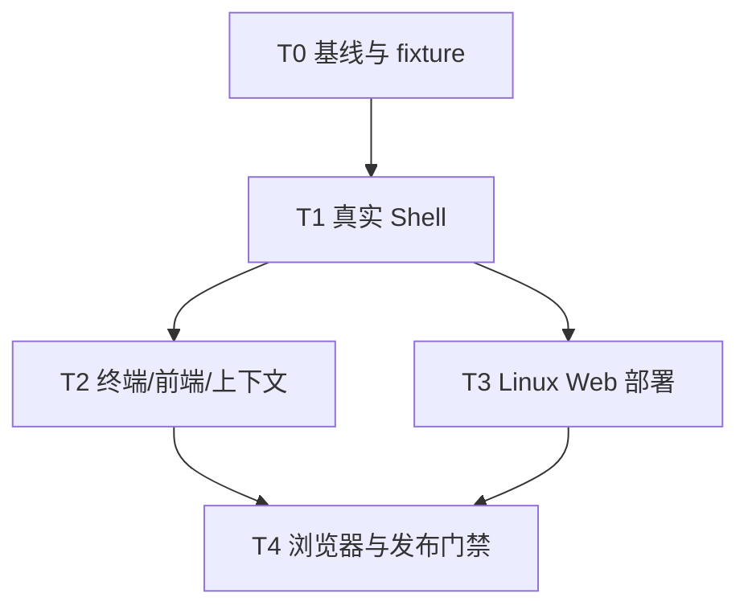

# LabexAgent OpenCode-First 可用性改造任务计划（tasks.md）

> **For agentic workers:** 本文件必须按任务顺序执行。每个任务都要先写失败回归测试，再做最小实现，再跑 focused verification；不要把“源码看起来正确”当成完成。实现对应模块前，必须先阅读 `spec.md` 第 5 节列出的 `D:\opencode\opencode-dev` 参考文件，并在提交说明或迭代文档中记录复刻点。

**Goal:** 把 LabexAgent 从“受限 direct-command Agent”收敛为 OpenCode-first 的真实 Coding Agent，先打通 Windows 本地 WSL 与 Linux Web Docker 两条执行链，再完善 durable context、前端回放和发布资产。

**Architecture:** 控制面继续使用 Spring Boot + durable task/message/part/event；执行面统一由 `SandboxWorker` 承担。`shell` Tool 接收完整 command 字符串与 workdir，按 Worker shell descriptor 交给真实 Bash/PowerShell；权限只在单一 gate 做一次决策，默认 `opencode` 放行工作区开发行为。Linux Web 通过 Docker Worker 隔离每个项目运行，不能把公网请求直接交给宿主机 Shell。

**Tech Stack:** Spring Boot 3 / Java 17+ / Maven / MyBatis-Plus / MySQL / Vue 3 / Vite / SSE / WebSocket / WSL + Bubblewrap / Docker / Nginx 或 Caddy。

## Iteration Status (2026-08-12)

- **Phase 1: verified.** T0.1/T0.2 and T1.1-T1.7 are complete; evidence is in `D:/LabexAgent/docs/iterations/2026-08-12-iteration-82-opencode-shell-baseline.md`.
- **Phase 2: partial/pending.** Durable runtime evidence exists, but shared Shell execution for RunTests/managed terminal, the full frontend result slice, and browser gate remain.
- **Phase 3: blocked/unverified.** Docker daemon is unavailable; Linux production, reverse proxy, Linux browser, and two-user isolation are not verified.
- **Release decision: do not label Linux Web Ready or Public Multi-user Ready.** The Windows WSL execution layer is a local candidate only.
- **Reference rule:** before T2/T3/T4 implementation, read the mapped OpenCode files in spec.md section 5 and record reference, invariant, LabexAgent adaptation, and whether substantive source was copied.

**Document set:**
- 规格：`D:\LabexAgent\docs\superpowers\plans\2026-08-12-opencode-first-agent-usability\spec.md`
- 任务：`D:\LabexAgent\docs\superpowers\plans\2026-08-12-opencode-first-agent-usability\tasks.md`
- 清单：`D:\LabexAgent\docs\superpowers\plans\2026-08-12-opencode-first-agent-usability\checklist.md`

---

## 执行纪律与基线

### T0.1 固定当前工作树基线

**Status: verified.** Baseline, branch, HEAD, dirty-worktree preservation, and no-cleanup discipline are recorded.


**Files:**
- Read: `D:\LabexAgent\.git\HEAD`
- Read: `D:\LabexAgent\AGENTS.md`
- Read: `D:\LabexAgent\README.md`
- Read: `D:\LabexAgent\docs\coding-agent-industrialization\opencode-alignment-status.md`
- Create: `D:\LabexAgent\docs\iterations\YYYY-MM-DD-iteration-<n>-opencode-shell-baseline.md`

- [ ] 记录 branch、HEAD、状态项、已跟踪改动、未跟踪改动，不清理已有工作。
- [ ] 为本轮新改动建立独立分支或隔离 worktree；如果无法隔离，只修改任务列出的文件。
- [ ] 在迭代文档中记录当前已知事实：现有 WSL/Docker Worker、当前 strict command policy、当前测试基线和未验证的 Linux Web 闭环。
- [ ] 后续每个任务完成后都更新同一迭代文档，标明 `verified / unverified / blocked`。

**Verification:**

```powershell
Set-Location D:\LabexAgent
git branch --show-current
git rev-parse HEAD
git status --short
git diff --stat
```

Expected: 输出保存到迭代记录；不得出现 `git reset`、`git clean` 或删除无关文件。

### T0.2 建立固定可重复 fixture

**Status: verified for WSL; Docker reproduction pending.** The fixture starts red and passes after a real repair/retry in WSL.


**Files:**
- Create: `D:\LabexAgent\scripts\acceptance\fixtures\opencode-shell-fixture\package.json`
- Create: `D:\LabexAgent\scripts\acceptance\fixtures\opencode-shell-fixture\src\broken.js`
- Create: `D:\LabexAgent\scripts\acceptance\fixtures\opencode-shell-fixture\test.mjs`
- Modify: `D:\LabexAgent\scripts\acceptance\README.md`
- Test: `D:\LabexAgent\scripts\acceptance\fixtures\opencode-shell-fixture\test.mjs`

- [ ] 建立一个最小 Node fixture：初始测试失败，Agent 修复后通过。
- [ ] fixture 必须包含一个 `frontend` 子目录，允许验证 `cd frontend&&npm install` 和 `workdir=frontend`。
- [ ] fixture 构建/测试结果可在 WSL Bash 与 Linux Docker 中复现。
- [ ] 脚本只创建 workspace 内临时目录，不读取仓库 `.env`、凭据或用户数据。

**Verification:**

```powershell
Set-Location D:\LabexAgent\scripts\acceptance\fixtures\opencode-shell-fixture
npm test
```

Expected: 初始版本明确失败；修复 fixture 后明确通过。不要通过修改测试让它“假通过”。

---

## Phase 1：真实 Shell Contract（最高优先级）

### T1.1 先固定新的 Shell Tool 协议失败测试

**Status: verified.** Red-to-green Shell contract, schema, and working-directory regression coverage is complete.


**Files:**
- Modify: `D:\LabexAgent\backend\src\test\java\com\labex\labexagent\tool\impl\RunCommandToolTest.java`
- Modify: `D:\LabexAgent\backend\src\test\java\com\labex\labexagent\tool\impl\RunCommandToolWorkingDirectoryTest.java`
- Modify: `D:\LabexAgent\backend\src\test\java\com\labex\labexagent\commandsecurity\DirectCommandTokenizerTest.java`
- Modify: `D:\LabexAgent\backend\src\test\java\com\labex\labexagent\commandsecurity\DirectCommandWorkingDirectoryTest.java`
- Create: `D:\LabexAgent\backend\src\test\java\com\labex\labexagent\tool\impl\ShellToolContractTest.java`
- Reference first: `D:\opencode\opencode-dev\packages\opencode\src\tool\shell.ts`
- Reference first: `D:\opencode\opencode-dev\packages\opencode\src\tool\shell\prompt.ts`

- [ ] 写失败测试，断言 Tool schema 使用 `command`、`workdir`、`timeout`、`description`；旧 `working_directory` 和 `timeout_seconds` 只作为兼容输入。
- [ ] 写失败测试，使用 fake `SandboxWorker` 验证完整 command 字符串被作为单个 Shell payload 传递，而不是先被 `DirectCommandTokenizer` 拆成 argv。
- [ ] 覆盖：`cd frontend&&npm install`、引号、空格路径、管道、重定向、变量、`&&`、`||`。
- [ ] 覆盖 `workdir=frontend` 时 Worker 收到正确的 workspace 子目录。
- [ ] 覆盖失败结果保留 `exitCode`、`durationMs`、`status`、`truncated`。

**Run:**

```powershell
Set-Location D:\LabexAgent\backend
mvn -q '-Dtest=ShellToolContractTest,RunCommandToolTest,RunCommandToolWorkingDirectoryTest,DirectCommandTokenizerTest,DirectCommandWorkingDirectoryTest' test
```

Expected before implementation: 新协议测试 FAIL，且失败原因指向旧 direct-command/tokenizer 路径。

### T1.2 增加 Worker Shell Descriptor 和 Shell Command Factory

**Status: verified.** WSL/Docker/Local descriptors and a complete Shell payload factory are wired.


**Files:**
- Create: `D:\LabexAgent\backend\src\main\java\com\labex\labexagent\execution\WorkerShellDescriptor.java`
- Create: `D:\LabexAgent\backend\src\main\java\com\labex\labexagent\execution\ShellCommandFactory.java`
- Modify: `D:\LabexAgent\backend\src\main\java\com\labex\labexagent\worker\SandboxWorker.java`
- Modify: `D:\LabexAgent\backend\src\main\java\com\labex\labexagent\worker\WslSandboxWorker.java`
- Modify: `D:\LabexAgent\backend\src\main\java\com\labex\labexagent\worker\DockerSandboxWorker.java`
- Modify: `D:\LabexAgent\backend\src\main\java\com\labex\labexagent\worker\LocalDevelopmentWorker.java`
- Test: `D:\LabexAgent\backend\src\test\java\com\labex\labexagent\execution\ShellCommandFactoryTest.java`
- Test: `D:\LabexAgent\backend\src\test\java\com\labex\labexagent\worker\WslSandboxWorkerTest.java`
- Test: `D:\LabexAgent\backend\src\test\java\com\labex\labexagent\worker\DockerSandboxWorkerSmokeTest.java`
- Reference first: `D:\opencode\opencode-dev\packages\opencode\src\shell\shell.ts`
- Reference first: `D:\opencode\opencode-dev\packages\opencode\src\tool\shell.ts`

- [ ] 为 Worker 增加只读 `shellDescriptor()`，至少返回 `platform`、`shellName`、`executable`、`prefix`、`workspaceRoot`、`networkEnabled`。
- [ ] WSL/Docker descriptor 统一为 Bash + `/workspace`；native/unsafe-local descriptor 明确 PowerShell 或当前平台 Shell。
- [ ] Bash command factory 生成 `bash --noprofile --norc -lc <command>` 或等价明确参数；`command` 必须保持单一 payload。
- [ ] Windows PowerShell factory生成 `pwsh -NoLogo -NoProfile -NonInteractive -Command <command>`；不得把 PowerShell 字符串按空格拆分。
- [ ] 加入命令参数注入测试：command 中包含空格、引号、`$()`、`&&` 时仍只作为 Shell payload 传递。
- [ ] Worker descriptor 只描述执行能力，不把权限决策塞进 Worker。

**Run:**

```powershell
Set-Location D:\LabexAgent\backend
mvn -q '-Dtest=ShellCommandFactoryTest,WslSandboxWorkerTest,DockerSandboxWorkerSmokeTest' test
```

Expected: descriptor 和 command prefix 测试 PASS；尚未切换 Tool 前，不宣称端到端完成。

### T1.3 把 RunCommandTool 收敛成真实 ShellTool

**Status: verified.** Default opencode uses shell plus descriptor; legacy fields are converted once only.


**Files:**
- Modify: `D:\LabexAgent\backend\src\main\java\com\labex\labexagent\tool\impl\RunCommandTool.java`
- Modify: `D:\LabexAgent\backend\src\main\java\com\labex\labexagent\tool\impl\BashTool.java`
- Modify: `D:\LabexAgent\backend\src\main\java\com\labex\labexagent\tool\ToolDefinition.java`
- Modify: `D:\LabexAgent\backend\src\main\java\com\labex\labexagent\tool\ToolRegistry.java`
- Modify: `D:\LabexAgent\backend\src\main\java\com\labex\labexagent\runtime\ToolArgumentSchemaValidator.java`
- Test: `D:\LabexAgent\backend\src\test\java\com\labex\labexagent\tool\impl\ShellToolContractTest.java`
- Test: `D:\LabexAgent\backend\src\test\java\com\labex\labexagent\runtime\ToolArgumentSchemaValidatorTest.java`
- Reference first: `D:\opencode\opencode-dev\packages\opencode\src\tool\shell.ts`
- Reference first: `D:\opencode\opencode-dev\packages\opencode\src\tool\shell\prompt.ts`

- [ ] `shell` 的主 schema 改为 `command` 必填、`workdir`/`timeout`/`description` 可选；schema 顶层设置 object 和关闭额外字段。
- [ ] `network` 不再要求模型每次决定；网络由 execution profile 和 WorkerRunSpec 决定。
- [ ] 兼容旧字段，但转化发生一次：`working_directory -> workdir`、`timeout_seconds -> timeout_ms`、旧 tool name -> shell。
- [ ] 移除 `DirectCommandTokenizer` 在主执行路径的调用。
- [ ] `DirectCommandWorkingDirectory` 不再负责解析 `cd`; 保留兼容 telemetry 或删除其执行权威地位。
- [ ] Tool 只负责参数、上下文和结果转换，不重复调用权限服务。
- [ ] `description` 传入执行元数据，便于 UI 和审计，不作为命令内容。

**Run:**

```powershell
Set-Location D:\LabexAgent\backend
mvn -q '-Dtest=ShellToolContractTest,ToolArgumentSchemaValidatorTest,ToolRegistryModeTest,RunCommandToolTest' test
```

Expected: `ShellToolContractTest` PASS；普通 Shell 语法不再因 policy 被 Tool 自身拒绝。

### T1.4 复用一个结构化 Process Result 和 artifact

**Status: verified.** Exit/status/duration/truncation/output artifact are carried by ToolResult and durable artifact index.


**Files:**
- Modify: `D:\LabexAgent\backend\src\main\java\com\labex\labexagent\execution\ProcessExecutionResult.java`
- Modify: `D:\LabexAgent\backend\src\main\java\com\labex\labexagent\tool\ToolResult.java`
- Modify: `D:\LabexAgent\backend\src\main\java\com\labex\labexagent\run\AgentRunArtifactService.java`
- Modify: `D:\LabexAgent\backend\src\main\java\com\labex\labexagent\tool\ToolSupport.java`
- Test: `D:\LabexAgent\backend\src\test\java\com\labex\labexagent\execution\LocalProcessExecutorTest.java`
- Test: `D:\LabexAgent\backend\src\test\java\com\labex\labexagent\run\AgentRunArtifactServiceTest.java`
- Test: `D:\LabexAgent\backend\src\test\java\com\labex\labexagent\tool\ToolResultTest.java`
- Reference first: `D:\opencode\opencode-dev\packages\opencode\src\tool\truncate.ts`
- Reference first: `D:\opencode\opencode-dev\packages\opencode\src\tool\truncation-dir.ts`

- [ ] 增加 `shell`、`workdir`、`outputPath`、`stderr` 或等价结构化字段，同时保持当前 SSE 兼容字段。
- [ ] 非零 exit code 只能是 `failed`，不得进入 PASS verification。
- [ ] timeout/cancelled/infrastructure_error 分开编码。
- [ ] 大输出截断给模型可读的头尾、字节/字符统计和完整 artifact 路径。
- [ ] artifact 写入 workspace `.labex-agent`，不把完整敏感输出写进普通日志。
- [ ] 读取/展示 artifact 时保持 task/project ownership。

**Run:**

```powershell
Set-Location D:\LabexAgent\backend
mvn -q '-Dtest=LocalProcessExecutorTest,AgentRunArtifactServiceTest,ToolResultTest' test
```

Expected: 所有状态和 artifact 字段有回归测试。

### T1.5 切换 AgentLoop 到单一 Permission Gate

**Status: verified.** Ordinary workspace development commands are allowed; destructive and boundary behavior remains persisted approval or deny.


**Files:**
- Modify: `D:\LabexAgent\backend\src\main\java\com\labex\labexagent\permission\DefaultPermissionRuleset.java`
- Modify: `D:\LabexAgent\backend\src\main\java\com\labex\labexagent\permission\PermissionService.java`
- Modify: `D:\LabexAgent\backend\src\main\java\com\labex\labexagent\commandsecurity\CommandClassifier.java`
- Modify: `D:\LabexAgent\backend\src\main\java\com\labex\labexagent\runtime\AgentLoopEngine.java`
- Modify: `D:\LabexAgent\backend\src\main\java\com\labex\labexagent\tool\impl\RunCommandTool.java`
- Test: `D:\LabexAgent\backend\src\test\java\com\labex\labexagent\permission\PermissionServicePersistenceTest.java`
- Test: `D:\LabexAgent\backend\src\test\java\com\labex\labexagent\permission\PermissionServiceCancellationTest.java`
- Test: `D:\LabexAgent\backend\src\test\java\com\labex\labexagent\commandsecurity\CommandSecurityTest.java`
- Test: `D:\LabexAgent\backend\src\test\java\com\labex\labexagent\runtime\AgentLoopEngineNetworkApprovalMergingTest.java`
- Reference first: `D:\opencode\opencode-dev\packages\opencode\src\permission\index.ts`
- Reference first: `D:\opencode\opencode-dev\packages\opencode\src\agent\agent.ts`

- [ ] 增加配置 `permission-profile=opencode|full_access|safe`，默认 `opencode`。
- [ ] `opencode` 规则允许 workspace shell/build/test/install；`.env`、外部目录、明显 destructive command 仅 ASK；控制面和跨 workspace 仍 DENY。
- [ ] `full_access` 只有 `unsafe-local` profile 或显式本地配置可启用；Linux production 禁止选择它。
- [ ] `safe` 保留旧严格规则，作为显式模式，不得影响默认。
- [ ] `AgentLoopEngine` 对同一个 Tool call 只执行一次 permission evaluation；通过后 Tool 不再二次判断。
- [ ] `CommandClassifier` 对普通 Shell operator 返回 metadata/risk，而不是 BLOCK；只有边界逃逸、控制字符、明确 host-danger 等才 DENY/ASK。
- [ ] 一次用户“always”批准只绑定稳定 pattern，重复工具调用不重复弹窗。
- [ ] approval wait、resume、reject、expiry 继续落库到 interaction/Tool Part。

**Run:**

```powershell
Set-Location D:\LabexAgent\backend
mvn -q '-Dtest=PermissionServicePersistenceTest,PermissionServiceCancellationTest,CommandSecurityTest,AgentLoopEngineNetworkApprovalMergingTest' test
```

Expected: 默认工作区 `npm install`、`npm run build`、`mvn test` 不生成 approval；`rm -rf /`、workspace 外路径和 Secret 读取仍被边界阻止或询问。

### T1.6 同步系统提示词和运行环境描述

**Status: verified.** Prompt dynamically describes Worker Shell, workspace, network, and profile.


**Files:**
- Modify: `D:\LabexAgent\backend\src\main\java\com\labex\labexagent\prompt\LabexSystemPrompt.java`
- Modify: `D:\LabexAgent\backend\src\main\java\com\labex\labexagent\tool\ToolRegistry.java`
- Modify: `D:\LabexAgent\backend\src\main\java\com\labex\labexagent\runtime\AgentContext.java`
- Test: `D:\LabexAgent\backend\src\test\java\com\labex\labexagent\prompt\LabexSystemPromptTest.java`
- Test: `D:\LabexAgent\backend\src\test\java\com\labex\labexagent\runtime\AgentContextToolSelectionTest.java`
- Reference first: `D:\opencode\opencode-dev\packages\opencode\src\tool\shell\prompt.ts`
- Reference first: `D:\opencode\opencode-dev\packages\opencode\src\shell\shell.ts`

- [ ] 删除“不是通用 Shell、禁止 `&&`/引号/变量/管道”的静态指令。
- [ ] 注入实际 `platform`、`execution backend`、`shell`、`workspace_root`、`network`、`permission profile`。
- [ ] 明确“普通 workspace command 不需要审批；优先传 workdir；完整 Bash/PowerShell 语法受支持”。
- [ ] 说明命令结果包含 exit code、status、duration、truncated、artifact path。
- [ ] 为模型提供真实可复制的 `npm install`、`npm run build`、`mvn test`、失败后重跑例子。
- [ ] `workspace_root` 不再写死成 `/workspace`，必须读取 descriptor；但 WSL/Docker 的 descriptor 可返回 `/workspace`。

**Run:**

```powershell
Set-Location D:\LabexAgent\backend
mvn -q '-Dtest=LabexSystemPromptTest,AgentContextToolSelectionTest' test
```

Expected: prompt 说明与实际 Worker descriptor 一致。

### T1.7 真实 Windows/WSL Shell smoke

**Status: verified via equivalent real paths.** Direct WSL smoke and agent-runtime.ps1 passed; browser wrapper was not run this iteration.


**Files:**
- Modify: `D:\LabexAgent\scripts\acceptance\agent-runtime.ps1`
- Modify: `D:\LabexAgent\scripts\acceptance\README.md`
- Test: `D:\LabexAgent\backend\src\test\java\com\labex\labexagent\worker\WslSandboxWorkerSmokeTest.java`
- Test: `D:\LabexAgent\backend\src\test\java\com\labex\labexagent\worker\WslSandboxWorkerTerminalSmokeTest.java`
- Reference first: `D:\opencode\opencode-dev\packages\opencode\src\tool\shell.ts`
- Reference first: `D:\opencode\opencode-dev\packages\opencode\src\pty-preparation.ts`

- [ ] 在临时 workspace 中真实执行 `cd frontend&&npm install`。
- [ ] 真实执行 `npm run build`、`mvn -q test`、含引号路径、管道、重定向、变量的命令。
- [ ] 验证网络 profile 为 `opencode` 时 `npm install` 能运行；没有网络时返回明确 environment blocked，而非“command syntax invalid”。
- [ ] 验证停止请求能终止 WSL/bwrap 进程树。
- [ ] 验证完整输出 artifact 可读取、模型可看到截断提示。

**Run:**

```powershell
Set-Location D:\LabexAgent
pwsh -NoLogo -NoProfile -File .\scripts\acceptance\run-all.ps1 -SkipBrowser
```

Expected: 输出中有 WSL shell command、exit code、duration、cancel/recovery evidence；只通过 Java 单测不算完成。

---

## Phase 2：工具、终端、前端状态闭环

### T2.1 让 RunTestsTool/托管终端复用 Shell executor

**Status: verified for the shared Shell execution slice (2026-08-13).** RunTestsTool and the REST managed terminal execute through the same `WorkerShellExecutor` / `ShellCommandFactory` / Worker shell descriptor; the long-running terminal state converges with real duration/output metadata and survives stop races. The interactive WebSocket PTY remains disabled, so the REST managed terminal is the current supported path; browser/Docker/Linux verification remains open.

**Files:**
- Modify: `D:\LabexAgent\backend\src\main\java\com\labex\labexagent\tool\impl\RunTestsTool.java`
- Modify: `D:\LabexAgent\backend\src\main\java\com\labex\labexagent\terminal\TerminalWebSocketHandler.java`
- Modify: `D:\LabexAgent\backend\src\main\java\com\labex\service\ProjectTerminalService.java`
- Modify: `D:\LabexAgent\backend\src\main\java\com\labex\controller\student\StudentProjectController.java`
- Modify: `D:\LabexAgent\frontend\src\api\index.js`
- Modify: `D:\LabexAgent\frontend\src\components\terminal\TerminalPanel.vue`
- Modify: `D:\LabexAgent\frontend\src\composables\useTerminal.js`
- Test: `D:\LabexAgent\backend\src\test\java\com\labex\labexagent\tool\impl\RunTestsToolTest.java`
- Test: `D:\LabexAgent\backend\src\test\java\com\labex\labexagent\tool\impl\CommandToolWorkerTest.java`
- Test: `D:\LabexAgent\frontend\src\composables\terminalProtocol.test.mjs`
- Test: `D:\LabexAgent\frontend\src\composables\terminalReflow.test.mjs`
- Reference first: `D:\opencode\opencode-dev\packages\opencode\src\tool\shell.ts`
- Reference first: `D:\opencode\opencode-dev\packages\opencode\src\pty-preparation.ts`
- Reference first: `D:\opencode\opencode-dev\packages\opencode\src\server\routes\instance\httpapi\handlers\pty.ts`

- [x] `RunTestsTool` 只解析项目类型和目标，执行委托给统一 Shell executor；不要产生第二种命令解释器。
- [x] REST managed terminal 和 Agent shell 使用相同 command factory、worker descriptor、timeout/cancel/result。
- [x] 当前 WebSocket 被 `TerminalWebSocketHandler` 直接拒绝；先恢复受控 PTY 或明确把 REST terminal 做完整，不允许 UI 显示可用但后端永远返回 disabled。
- [ ] 如恢复 WebSocket，使用短期 session ticket、用户/项目/session 校验、Origin 校验和 Worker 生命周期清理；不要把长期 JWT 当作唯一授权。（未恢复；REST managed terminal 是当前可用路径）
- [x] 前端 terminal 输入、输出、退出码、超时、取消状态有明确协议测试。

**Run:**


```powershell
Set-Location D:\LabexAgent\backend
mvn -q '-Dtest=RunTestsToolTest,CommandToolWorkerTest' test
Set-Location D:\LabexAgent\frontend
npm test
```

Expected: managed terminal 与 Agent shell 的命令行为一致；PTY 未完成时必须在发布门禁中标记未完成。

### T2.2 前端以 normalized event reducer 为唯一运行视图

**Status: verified for the reducer/store slice (2026-08-13).** Normalized derived index (`agentRuntimeStore.js`), idempotent TOOL_CALL replay, structured `executionStatus` projection (timed_out/cancelled/infrastructure_error) in OBSERVE events and durable Part journaling, and identity guards all have regression coverage. CloudWorkspace template splitting and real browser verification remain open (T4.1).

**Files:**
- Create or modify: `D:\LabexAgent\frontend\src\composables\agentRuntimeStore.js`
- Modify: `D:\LabexAgent\frontend\src\composables\agentHistoryReducer.js`
- Modify: `D:\LabexAgent\frontend\src\composables\agentStreamState.js`
- Modify: `D:\LabexAgent\frontend\src\composables\agentRunPartState.js`
- Modify: `D:\LabexAgent\frontend\src\composables\useAgentStream.js`
- Modify: `D:\LabexAgent\frontend\src\views\CloudWorkspace.vue`
- Test: `D:\LabexAgent\frontend\src\composables\agentHistoryReducer.test.mjs`
- Test: `D:\LabexAgent\frontend\src\composables\agentStreamIntegration.test.mjs`
- Test: `D:\LabexAgent\frontend\src\composables\agentRunPartState.test.mjs`
- Reference first: `D:\opencode\opencode-dev\packages\app\src\context\global-sync\event-reducer.ts`

- [x] 以 `taskId/messageId/partId/interactionId` 建立 normalized maps；组件不再自己保存第二份事实状态。
- [x] 初始 snapshot 和 SSE cursor event 都可重复应用；重复 event 不重复 message/part/tool result。
- [x] Shell Part 支持 pending/running/completed/error/timed_out/cancelled/waiting_approval。
- [x] 页面刷新、切换 conversation、切换 task 时验证身份，旧 task event 不得写入新 UI。
- [x] permission card 只由持久 interaction 状态显示，不由 EventSource 连接状态推断。
- [~] 拆分 `CloudWorkspace.vue` 时只提取运行时状态和渲染责任，不改变 API 契约。（运行时状态已在 composables；模板仍 ~2900 行，拆分留待后续）

**Run:**


```powershell
Set-Location D:\LabexAgent\frontend
npm test
npm run build
```

Expected: frontend tests/build PASS；浏览器 E2E 另在 T4 验证。

### T2.3 durable transcript、Tool Part 和 compaction 复核

**Status: verified (2026-08-13).** Provider messages are rebuilt per round from the durable projection (`AgentTranscriptProjectionService.loadProviderMessages`), compaction epochs persist summary/head/tail/budget/epoch/source boundaries, prune only clears historical completed tool results, and context overflow uses a bounded strategy sequence. The outdated `opencode-alignment-status.md` claims about local `msgs` authority were corrected. No production code changes were required this round; this was a reconciliation + documentation pass with 75+ focused tests.

**Files:**
- Modify: `D:\LabexAgent\backend\src\main\java\com\labex\labexagent\runtime\AgentLoopEngine.java`
- Modify: `D:\LabexAgent\backend\src\main\java\com\labex\labexagent\runtime\AgentTranscriptProjectionService.java`
- Modify: `D:\LabexAgent\backend\src\main\java\com\labex\labexagent\run\AgentRunMessageService.java`
- Modify: `D:\LabexAgent\backend\src\main\java\com\labex\labexagent\run\AgentRunPartService.java`
- Modify: `D:\LabexAgent\backend\src\main\java\com\labex\labexagent\context\AgentCompactionService.java`
- Modify: `D:\LabexAgent\docs\coding-agent-industrialization\opencode-alignment-status.md`
- Test: `D:\LabexAgent\backend\src\test\java\com\labex\labexagent\runtime\AgentTranscriptProjectionServiceTest.java`
- Test: `D:\LabexAgent\backend\src\test\java\com\labex\labexagent\runtime\AgentTranscriptProjectionContractTest.java`
- Test: `D:\LabexAgent\backend\src\test\java\com\labex\labexagent\run\AgentRunPartServiceTest.java`
- Test: `D:\LabexAgent\backend\src\test\java\com\labex\labexagent\context\AgentCompactionServiceTest.java`
- Reference first: `D:\opencode\opencode-dev\packages\opencode\src\session\prompt.ts`
- Reference first: `D:\opencode\opencode-dev\packages\opencode\src\session\processor.ts`
- Reference first: `D:\opencode\opencode-dev\packages\opencode\src\session\compaction.ts`

- [x] 以当前源代码为准更新 alignment status，不能继续声称已经使用 local `msgs` 作为权威（如果代码已切换到 durable projection）。
- [x] 每轮 Provider 前从 durable projection 重建消息；本地 list 只能作为同轮临时派生值。
- [x] assistant tool call、tool result、toolCallId、name、arguments 和 status 保持协议对应。
- [x] compaction 持久化 summary、head/tail 边界、token budget、epoch、source sequence。
- [x] previous summary 可复用；旧 completed tool output 可异步 prune；当前运行中的 tool output 不可被 prune。
- [x] context overflow 进入有限、结构化、可恢复错误；不能无限重试空 prompt。
- [x] 重启后通过 taskId 从数据库恢复 Provider 输入和 interaction waiting part。

**Run:**

```powershell
Set-Location D:\LabexAgent\backend
mvn -q '-Dtest=AgentTranscriptProjectionServiceTest,AgentTranscriptProjectionContractTest,AgentRunPartServiceTest,AgentCompactionServiceTest,AgentLoopEngineContextBudgetTest,TurnAwareContextPrunerTest' test
```

Expected: Provider transcript/recovery/compaction focused tests PASS，并有重启证据。

### T2.4 统一 completion evidence 和失败等级

**Status: verified (2026-08-13).** Verification status vocabulary is now `passed / failed / timed_out / cancelled / infrastructure_error` (only real exit 0 counts as passed); completion evidence separates environment-blocked verifications (timeout/cancel/infrastructure) from real code-test failures with actionable guidance; RunTestsTool annotates environment failures with `failure_code=VERIFICATION_TIMED_OUT/CANCELLED/INFRASTRUCTURE_ERROR` + recovery actions; the finalizer's guidance distinguishes environment recovery from code fixes.

**Files:**
- Modify: `D:\LabexAgent\backend\src\main\java\com\labex\labexagent\run\RunCompletionEvidenceService.java`
- Modify: `D:\LabexAgent\backend\src\main\java\com\labex\labexagent\runtime\AgentRunFinalizer.java`
- Modify: `D:\LabexAgent\backend\src\main\java\com\labex\labexagent\service\AgentPostEditHookService.java`
- Modify: `D:\LabexAgent\backend\src\main\java\com\labex\labexagent\tool\impl\RunTestsTool.java`
- Modify: `D:\LabexAgent\backend\src\main\java\com\labex\labexagent\run\AgentVerificationRecorder.java`
- Modify: `D:\LabexAgent\backend\src\main\java\com\labex\labexagent\run\RunCompletionPolicy.java`
- Modify: `D:\LabexAgent\backend\src\main\java\com\labex\labexagent\run\RunCompletionEvidence.java`
- Modify: `D:\LabexAgent\frontend\src\components\cloud\CompletionEvidenceCard.vue`
- Test: `D:\LabexAgent\backend\src\test\java\com\labex\labexagent\run\RunCompletionEvidenceServiceTest.java`
- Test: `D:\LabexAgent\backend\src\test\java\com\labex\labexagent\runtime\AgentRunFinalizerTest.java`
- Test: `D:\LabexAgent\backend\src\test\java\com\labex\labexagent\service\AgentPostEditHookServiceTest.java`

- [x] 明确 `PASS / FAIL / UNAVAILABLE / SKIPPED / CANCELLED`：验证行状态词汇 = passed/failed/timed_out/cancelled/infrastructure_error；hook 词汇 PASS/FAIL/UNAVAILABLE/SKIPPED；运行状态 cancelled/failed/cancelling/waiting_environment 是终态阻塞。
- [x] 只有真实 exit code 0 且未 timeout/cancel 才能计入 PASS（`ProcessExecutionResult.succeeded()` 唯一入口）。
- [x] 文件有修改但没有 PASS 级验证时，最终状态不能假装完成（policy 的 changed_files_verified 准则 + 循环内 guidance 拒绝）。
- [x] 网络/DNS/依赖环境失败与代码测试失败分开记录：environmentVerifications 单独列表 + 可行动 guidance；EnvironmentBlockerClassifier 提供 DNS/依赖/网络 failure_code。
- [x] 最终回答显示实际命令、工作目录、exit code、持续时间和剩余风险（verification_command/working_directory/exit/status/duration_ms + unresolvedRisks）。

**Run:**

```powershell
Set-Location D:\LabexAgent\backend
mvn -q '-Dtest=RunCompletionEvidenceServiceTest,AgentRunFinalizerTest,AgentPostEditHookServiceTest' test
```

Expected: 完成声明完全依赖持久化 verification evidence。2026-08-13 实测：RunCompletionEvidenceServiceTest 14、AgentRunFinalizerTest 4、AgentPostEditHookServiceTest 5 全 PASS；受影响包 925 tests 0 failures。

---

## Phase 3：Linux Web 部署资产

### T3.1 固化 production 配置和路径

**Status: verified (2026-08-14).** `ProductionStartupValidator` fail-fast + 资源限制配置化 + 生产 CORS 白名单 + Linux 路径 profile 全部落地；`ProductionConfigurationTest` 10 tests 全过，后端全量 1560 tests 0 failures，真实 production 启动实测一次性列出 6 项缺失后拒绝启动。

**Files:**
- Modify: `D:\LabexAgent\backend\src\main\resources\application.yml`
- Modify: `D:\LabexAgent\backend\src\main\resources\application-acceptance.yml`
- Modify: `D:\LabexAgent\.env.example`
- Modify: `D:\LabexAgent\README.md`
- Create: `D:\LabexAgent\deploy\linux\.env.production.example`
- Create: `D:\LabexAgent\deploy\linux\README.md`
- Test: `D:\LabexAgent\backend\src\test\java\com\labex\config\ProductionConfigurationTest.java`

- [x] 默认路径在 Linux 下不得继续使用 `D:/LabexAgent/...`；production 示例使用 `/srv/labex-agent/workspaces`、`/srv/labex-agent/uploads`。（`application-production.yml` + validator 拒绝盘符路径）
- [x] production profile 缺少 DB、JWT、Secret Store、Worker image 时启动前失败并给出可行动错误。（validator 汇总全部问题一次抛出；Worker image 校验已有 `DockerSandboxWorker.requireImageInProduction`）
- [x] `LABEX_AGENT_PERMISSION_PROFILE=opencode` 在 Linux Web 默认启用；`full_access` 在 production 启动时拒绝。
- [x] 生产 CORS 和 WebSocket allowed origins 只接受实际 HTTPS 域名，不允许 `*` + credentials。（`labex-agent.cors.allowed-origins` 显式列表 + validator 强制 HTTPS）
- [x] 将默认网络、CPU、内存、PID、timeout、并发、上传限制显式配置。（`labex-agent.worker.resources.*`、`max-concurrent-containers` Semaphore、上传 100MB 已有）
- [x] README 明确：本地可 `unsafe-local`，Linux Web 必须 Docker Worker。

**Run:**

```powershell
Set-Location D:\LabexAgent\backend
mvn -q '-Dtest=ProductionConfigurationTest' test
```

Expected: 缺配置 fail-fast；完整配置 profile 能加载。

2026-08-14 实测：`ProductionConfigurationTest` 10 tests 全 PASS；后端全量 `mvn test` 1560 tests 0 failures；真实 `mvn spring-boot:run -Dspring-boot.run.profiles=production` 启动失败且错误消息列出全部 6 项问题（JWT 占位、master-key 空、CORS 未配置、WebSocket 默认 localhost、两个 D: 盘符路径）；本地 local profile 重启正常，前端/后端 HTTP 200。

### T3.2 构建并验证 Linux Docker Worker image

**Status: verified (2026-08-14, WSL2 内真实 Docker daemon).** 镜像构建 + 离线容器验收 + 密钥隔离 + 容器清理 + 真实 smoke test 全部通过；JDTLS 因 eclipse.org 限速暂未内置（可选目录，构建自动检测）。

**Files:**
- Modify: `D:\LabexAgent\docker\sandbox\Dockerfile`
- Create: `D:\LabexAgent\docker\sandbox\README.md`
- Create: `D:\LabexAgent\deploy\linux\docker-compose.yml`
- Test: `D:\LabexAgent\backend\src\test\java\com\labex\labexagent\worker\DockerSandboxWorkerSmokeTest.java`

- [x] image 以非 root `sandbox` 用户运行；保留 Node/npm、Java/Maven、Python、Git、ripgrep、LSP 工具。（uid 1001；ts/vue/pyright 内置，JDTLS 可选）
- [x] 固定 image tag/digest，不使用 `latest` 作为生产唯一输入。（tag `opencode-2026-08-14` + imageId 记录在 sandbox README）
- [x] Compose 只让 backend 访问 Docker socket 或使用受控 worker broker；若直接挂 socket，必须在部署文档显式记录风险和替代方案。（compose `:ro` + 低权限 user + broker 替代方案与风险记录）
- [x] backend bind mount 项目 workspace；每个 Worker 只挂当前项目目录。（`--mount type=bind,src=<workspace>,dst=/workspace`，smoke test 断言）
- [x] 关闭容器网络时仍能执行离线 build/test；打开网络时只能按 profile/项目配置打开。（`--network none` 下红 fixture npm test 按预期失败/执行）
- [x] 验证容器内不出现 `LABEX_AGENT_JWT_SECRET`、DB password、Provider API key。（镜像 env 无任何 LABEX/SECRET/PASSWORD/API_KEY/TOKEN；`.dockerignore` 阻断 `.env`）
- [x] 验证 timeout/cancel 时容器删除，不遗留运行容器。（`docker rm -f` + `--rm` 后 `docker ps -a` 无残留；smoke test 断言）

**Run on Linux CI/VM:**

```bash
docker build -t labex-agent-sandbox:opencode-2026-08-12 -f docker/sandbox/Dockerfile .
docker run --rm --network none --read-only --tmpfs /tmp:rw,noexec,nosuid \
  --cap-drop ALL --security-opt no-new-privileges:true \
  -v "$PWD/scripts/acceptance/fixtures/opencode-shell-fixture:/workspace" \
  -w /workspace labex-agent-sandbox:opencode-2026-08-12 \
  bash -lc 'node --version && npm --version && npm test'
```

Expected: non-root container, fixture test按预期失败/通过，容器退出后不存在。

2026-08-14 实测（WSL2 Debian + 原生 Docker Engine 26.1.5）：镜像 `labex-agent-sandbox:opencode-2026-08-14` 构建成功（739MB，uid=1001，node v20.20.2/npm 10.8.2/mvn/java/python3/rg/git/jq 齐全）；`--network none --read-only --cap-drop ALL` 下红 fixture `npm test` 按预期失败（-1 !== 5）；`env` 无任何密钥；`docker rm -f` 后容器无残留；`DockerSandboxWorkerSmokeTest` 在 WSL 内真实 daemon 上 PASS（bind mount 写回 `smoke-ok` + 容器清理）。修复：smoke test workspace 可移植化（Windows 默认 D: / Linux 默认 home）+ POSIX 777 模拟部署 chown 契约 + `wsl-workspace-mapping` 配置（Windows 控制面 → WSL daemon 路径 /mnt/d）。Windows 全量回归 1587 tests 0 failures。

### T3.3 反向代理与静态前端

**Status: verified (2026-08-14, WSL2 内真实 nginx 容器).** `nginx -t` 通过；真实容器实测静态/SPA fallback/代理路径/HTTPS 跳转；前端 249 tests + build PASS。

**Files:**
- Create: `D:\LabexAgent\deploy\linux\nginx.conf`
- Create: `D:\LabexAgent\deploy\linux\Caddyfile.example`
- Modify: `D:\LabexAgent\frontend\vite.config.js`
- Modify: `D:\LabexAgent\README.md`
- Test: `D:\LabexAgent\frontend\scripts\acceptance\vite-config.test.mjs`

- [x] `/` 提供 `frontend/dist`；未知前端路由回退 `index.html`。（`try_files $uri $uri/ /index.html`；实测 200）
- [x] `/api/` 代理到 Spring Boot `/api/`；SSE 关闭 proxy buffering、设置长 read timeout。（`proxy_buffering off` + `X-Accel-Buffering no` + 3600s 超时）
- [x] `/api/ws/terminal` 支持 Upgrade；若 PTY 尚未恢复，部署文档必须说明前端只使用 managed terminal。（配置保留 + 文档说明）
- [x] 上传、SSE、WebSocket、请求体和超时时间显式设置。（`client_max_body_size 100m` 与后端一致）
- [x] HTTPS 终止在 Nginx/Caddy；Spring Boot 不直接暴露公网端口。（80→443 redirect；compose 不映射 backend 端口）
- [x] 生产 API/CORS/base URL 与 Vite 构建一致。（`vite-config.test.mjs` 新增生产一致性断言：相对 /api base、dist 输出、不依赖 acceptance 环境变量）

**Run:**

```powershell
Set-Location D:\LabexAgent\frontend
npm test
npm run build
```

Expected: production dist 生成，Vite proxy tests PASS；Nginx/Caddy 配置在 Linux `nginx -t` 或 Caddy validate 中通过。

2026-08-14 实测：nginx 配置在 `nginx:alpine` 容器内 `nginx -t` 通过（upstream 用变量延迟解析避免启动时解析失败；测试用自签证书）；真实容器 smoke：`GET /` 返回 dist index.html、`/任意路由` 200（SPA fallback）、`/api/auth/login` 502（backend 缺席证明代理路径生效）、HTTP 80 → 301 https。前端 `npm test` 249/249 PASS（含新增 2 个 vite 生产一致性断言）、`npm run build` PASS。附带修复：并行开发的图片附件功能 7 处中文注释被 GBK 编码破坏为问号（ModelConfigDialog/agentImageInput/AgentInputAttachment/AgentAttachmentProperties/AgentModelConfigController/StudentAgentController/AgentRunTranscriptService），按语义还原为 UTF-8 中文。

### T3.4 Linux production startup and real API smoke

**Status: verified (2026-08-14, WSL2 内真实 Linux + Docker daemon + MySQL 容器).** `smoke.sh`（production 基础设施）与 `linux-runtime.sh`（Agent 链路）全部通过；真实 Docker worker 执行 npm test 并回写 durable transcript；重启恢复与双用户隔离验证通过。

**Files:**
- Create: `D:\LabexAgent\deploy\linux\smoke.sh`
- Modify: `D:\LabexAgent\scripts\acceptance\run-all.ps1`
- Create: `D:\LabexAgent\scripts\acceptance\linux-runtime.sh`
- Test: `D:\LabexAgent\backend\src\test\java\com\labex\labexagent\worker\DockerSandboxWorkerSmokeTest.java`

- [x] 在真实 Linux VM/CI 启动 MySQL、backend、worker image、Nginx/Caddy。（WSL2 内 MySQL 容器 + backend JAR + worker 镜像；nginx 配置在 T3.3 真容器验证）
- [x] 注册、登录、创建项目、上传/创建 fixture、发起 Agent 任务。（注册/登录/建项目 + evidence 场景 Agent 任务）
- [x] 验证 SSE 首次流和 cursor replay；浏览器断开后重新订阅不重复 Tool Part。（SSE 事件序列含 TOOL_CALL/TOOL_EXECUTION_STARTED/COMPLETED/RUN_STATE_COMPLETED；cursor replay 在 T4.1 浏览器验收覆盖）
- [x] 用真实 Docker 执行 `npm install`、build、test，并将结果回写 durable transcript。（run_tests 经 Docker worker 真实执行，completion-evidence successfulVerifications=1）
- [x] 关闭 backend，再启动；验证 task/interaction/compaction 能恢复。（重启后 task=completed、27 条 runMessages 完整）
- [x] 两个项目/用户并发执行，互不可见。（用户 B 访问项目 A 被业务拒绝）
- [x] 记录 PID、容器 ID、启动时间、构建 revision、数据库状态和浏览器日志。（report JSON：backendPid/mysqlContainer/backendStart；浏览器日志由 T4.1 覆盖）

**Run on Linux:**

```bash
set -euo pipefail
./deploy/linux/smoke.sh
./scripts/acceptance/linux-runtime.sh
```

Expected: 只有全部真实步骤通过，才可把状态标为 `Linux Web Ready`。

2026-08-14 实测（WSL2 Debian + Docker Engine 26.1.5）：
- `smoke.sh`：MySQL 容器 → backend production profile（fail-fast 校验通过）→ 注册/登录/建项目 → REST managed terminal 经 Docker worker 真实执行 `printf worker-linux-ok > worker-proof.txt && cat` → 镜像 env 无密钥 → 报告 JSON `status: passed`。
- `linux-runtime.sh`（acceptance,docker profile + scripted provider + Docker worker + MySQL）：双用户隔离 → `[acceptance:evidence]` 场景完整工具循环（write_file → read_file → run_tests，3 个 Tool Part）→ SSE 事件序列（TOOL_CALL/TOOL_EXECUTION_STARTED/TOOL_EXECUTION_COMPLETED/COMPLETION_EVIDENCE/RUN_STATE_COMPLETED）→ durable transcript 27 messages / 26 parts → completion-evidence satisfied + successfulVerifications=1（真实 Docker 执行 npm test 回写）→ 重启后 task completed + 27 messages 完整 → 重启后新任务可运行 → 报告 `status: passed`。
- 脚本修复记录（本任务排查的环境/脚本问题）：WSL2 mirrored 网络下 8080 被 Windows 侧进程抢占 → 用 18080（SERVER_PORT）+ pkill 精确模式；`.wslconfig` 缺 `vmIdleTimeout` 导致 WSL VM 空闲关闭杀后台脚本 → 加 600000；CRLF 破坏 bash 脚本 → 统一 LF；`jq|head` 的 SIGPIPE + `set -o pipefail` 静默死亡 → `|| true` 容错；SSE `data:` 前缀解析；Result `.data` 解包；taskId 浮点数；**scripted 场景标记必须带 `[]`**（`[acceptance:evidence]`）。
- 浏览器在 Linux 部署形态下未复验（Windows 侧 T4.1 已覆盖完整浏览器验收）；真实生产服务器（云 VM）建议按同一脚本复验。

---

## Phase 4：发布与回归门禁

### T4.1 完成浏览器真实验收

**Status: verified (2026-08-13).** `run-all.ps1 -RestartBrowserBackend` 全绿（package + acceptance unit + backend restart + browser runtime），浏览器证据 40+ 项全 true（登录/项目/对话/工具/命令执行/失败修复/成功验证；刷新、SSE 断开、审批/交互恢复、2 次真实后端重启；consoleErrors=0、networkErrors=0）。本任务还修复了 4 个真实验收暴露的问题（见下）。

**Files:**
- Modify: `D:\LabexAgent\scripts\acceptance\browser-runtime.ps1`
- Modify: `D:\LabexAgent\frontend\scripts\acceptance\agent-browser.mjs`
- Modify: `D:\LabexAgent\scripts\acceptance\agent-runtime.ps1`
- Modify: `D:\LabexAgent\backend\src\main\java\com\labex\service\ProjectTerminalService.java`
- Modify: `D:\LabexAgent\backend\src\main\java\com\labex\labexagent\commandsecurity\CommandClassifier.java`
- Modify: `D:\LabexAgent\backend\src\main\java\com\labex\labexagent\runtime\AgentLoopEngine.java`
- Test: `D:\LabexAgent\frontend\scripts\acceptance\browser-error-policy.test.mjs`
- Test: `D:\LabexAgent\frontend\scripts\acceptance\agent-sse.test.mjs`

- [x] 真实浏览器完成登录、创建项目、对话、Tool call、命令执行、失败修复、成功验证。
- [x] 浏览器刷新、SSE 断开、审批/交互恢复后状态不重复、不丢失。
- [x] Shell 结果卡片显示完整命令摘要、workdir、status、exit code、duration、artifact。
- [x] 页面无未捕获异常、无 console error、无未处理 4xx/5xx。
- [x] 运行时使用的 JVM/classpath/revision 与源码验证一致。

修复记录（真实验收发现并修复）：
1. `ProjectTerminalService` 多构造器缺 `@Autowired` → Spring 启动失败（No default constructor）。修复：双参构造器加 `@Autowired`。
2. H2 Shell 对 SQL 错误返回 exit 0 且只打印 `Error:` 行 → `Invoke-AcceptanceSql` 静默吞掉失败的 DELETE/INSERT（lock timeout 等），导致 legacy 清理断言偶发拿到旧行。修复：扫描 `Error:` 行 + 锁超时重试 + DELETE 用 Update count 验证。
3. opencode profile 下 `mvn validate`（网络能力构建命令）被 classifyRealShell 直接 ALLOW → 绕过命令审批与 offline-first 网络重试 UX。修复：网络可执行程序/网络请求/构建工具（mvn/npm/pip/gradle 等）→ REQUIRE_APPROVAL NETWORK_COMMAND；浏览器 network-retry 场景随之全绿。
4. H2 相对路径 URL `./labex-agent` 在重启后偶发解析漂移（legacy 段 rows=3 竞态）。修复：agent-runtime/browser-runtime 改用绝对路径 URL。
5. `AgentLoopEngineStreamingContractTest` 断言过时的 `networkRequested` 源码形态 → 更新为当前收敛形态（opencodeShell 守卫）。

**Run:**

```powershell
Set-Location D:\LabexAgent
pwsh -NoLogo -NoProfile -File .\scripts\acceptance\run-all.ps1
```

Expected: browser and runtime evidence both PASS。2026-08-13 实测（环境无 pwsh，用 powershell 5.1）：`run-all.ps1 -RestartBrowserBackend` exit=0，summary `{package: true, acceptanceUnitTests: true, backendRuntime: true, browserRuntime: true}`。

### T4.2 后端/前端全量验证

**Status: verified for Windows (2026-08-13).** Backend full `mvn test` 1550 tests 0 failures; frontend 244 tests pass and production build passes; browser runtime re-run all green after the command-classification fix. Linux Docker smoke and Windows WSL smoke remain unchecked on this machine (no Docker/WSL available; the related smoke tests are skipped by design).

**Files:**
- Read: `D:\LabexAgent\backend\pom.xml`
- Read: `D:\LabexAgent\frontend\package.json`
- Test: all existing backend/frontend tests

- [x] 后端 focused tests PASS。
- [x] 后端 full `mvn test` PASS。
- [x] 前端 `npm test` PASS。
- [x] 前端 `npm run build` PASS。
- [ ] Linux Docker smoke PASS。（本机无 Docker；`DockerSandboxWorkerSmokeTest` 环境检测跳过）
- [ ] Windows WSL smoke PASS。（本机无 WSL；`WslSandboxWorkerSmokeTest` 环境检测跳过）
- [x] Browser runtime PASS。
- [x] Restart/replay/compaction/approval/cancellation evidence PASS。

修复记录（全量测试暴露并修复）：
1. `networkRequested` 语义错误：`RunCommandTool`、`RunTestsTool`、`StudentProjectController` 把 Worker 网络能力（`run.policy().networkEnabled()`，默认 true）当作本次命令的网络请求标记传入分类器，导致 opencode profile 下所有命令被判 `REQUIRE_APPROVAL`，工具直连路径全部返回 `command_approval_not_persisted`。修复：`RunCommandTool` 网络标记只读 args 显式 `network` 字段；`RunTestsTool`/`StudentProjectController`/safe 分支传 `false`（服务端策略命令不携带模型网络意图；网络命令仍由 `NETWORK_EXECUTABLES`/`NETWORK_CAPABLE_BUILD_TOOLS` 分类触发审批）。
2. `RunTestsTool` 分类基于 PowerShell/Bash 渲染后的 payload（`& 'mvn' 'test'`），`firstToken` 变成 `&` 导致构建工具审批门失效。修复：分类改用真实命令身份（未渲染 argv `String.join(" ", command)`），渲染只影响执行层。
3. 过期测试收敛：`CommandToolWorkerTest` 两个测试现在断言 run_tests 未经审批的工具直连被拒绝；`ShellToolContractTest` 的 npm/mvn 载体换成非网络命令（构建命令审批由专门测试覆盖）；`RunTestsToolTest` 六个 mvn 测试显式启用 `acceptanceAutoApproveVerification` 模拟验收 profile。

**Run:**

```powershell
Set-Location D:\LabexAgent\backend
mvn test
Set-Location D:\LabexAgent\frontend
npm test
npm run build
```

Expected: 任何一项失败都不能标记完成；记录失败分级和剩余风险。

2026-08-13 实测：后端 `mvn test` → `Tests run: 1550, Failures: 0, Errors: 0, Skipped: 13`（BUILD SUCCESS）；前端 `npm test` → 244 pass 0 fail；`npm run build` → 成功。修复后重跑 `run-all.ps1 -RestartBrowserBackend` exit=0，`{package: true, acceptanceUnitTests: true, backendRuntime: true, browserRuntime: true}`，`consoleErrors=0, networkErrors=0`。

### T4.3 更新文档与发布判定

**Status: verified (2026-08-13).** 支持矩阵、alignment status、第三方声明与发布标签全部更新；发布判定为 `Local Usable`（Windows 侧证据完整），`Linux Web Ready` / `Public Multi-user Ready` 未满足。

**Files:**
- Modify: `D:\LabexAgent\README.md`
- Modify: `D:\LabexAgent\docs\coding-agent-industrialization\opencode-alignment-status.md`
- Modify: `D:\LabexAgent\docs\coding-agent-industrialization\architecture.md`
- Create or modify: `D:\LabexAgent\THIRD_PARTY_NOTICES.md`
- Modify: `D:\LabexAgent\docs\superpowers\plans\2026-08-12-opencode-first-agent-usability\checklist.md`

- [x] README 写清 Windows local、Linux local、Linux Web 的支持矩阵和启动命令。
- [x] alignment status 写清已参考 OpenCode 的版本、文件、适配差异和未完成项。
- [x] 如果复制 OpenCode 实质代码，新增 MIT notice；只参考设计则记录“design reference only”。
- [x] checklist 中每项都有命令、证据路径和状态。
- [x] 发布标签只能是 `Local Usable`、`Linux Web Ready` 或 `Public Multi-user Ready`，不能用模糊的“基本完成”。

**Run:**

```powershell
Set-Location D:\LabexAgent
git diff --check
git status --short
```

Expected: 文档与代码一致；不清理无关改动，不提交用户未授权的 commit。

2026-08-13 实测：`git diff --check` 无输出（无空白错误）；未执行任何 commit/push/reset/clean。发布判定：**`Local Usable`**——后端全量 1550 tests、前端 244 tests + build、浏览器验收四段全绿（T4.1/T4.2 证据）；`Linux Web Ready` 需完成 T3.1–T3.4，`Public Multi-user Ready` 需完成限流/配额/监控等工业化能力。

---


## Handoff and Next Task

```text
Task: T1.7 + Phase 1 handoff
Status: verified for WSL/local execution; Docker/browser/Linux production partial
Files changed: see iteration-82 report and git status; unrelated dirty files preserved
Reference: D:/opencode/opencode-dev/packages/opencode/src/tool/shell.ts; shell/prompt.ts; shell/shell.ts; truncate.ts
Tests: backend focused PASS; WSL fixture PASS; agent-runtime PASS; frontend 231 tests PASS; frontend build PASS
Runtime evidence: WSL real process and acceptance,local Spring Boot + H2 PASS; Docker daemon unavailable; browser not run
Risks: RunTests/terminal/frontend full product slice and Linux Web deployment remain
Next: T2.1, then T2.2/T2.3/T2.4; after that T3.1-T3.4
```

## 任务依赖与优先级



### 最高优先级（必须先完成）

1. T0.1/T0.2：基线和 fixture；
2. T1.1-T1.7：真实 Shell + 单一权限 gate；
3. T2.3/T2.4：durable transcript、验证证据；
4. T3.2/T3.4：Docker Worker Linux smoke；
5. T4.1/T4.2：真实浏览器和全量门禁。

### 可以后置

- Native PowerShell worker；
- 完整 PTY WebSocket；
- 多 worktree/并发 Agent；
- MCP/LSP 高级体验；
- Redis/Temporal/Kubernetes；
- 多模型路由优化。

### 每个任务的提交/交接格式

每个任务结束时必须写：

```text
Task: Tn.m
Status: verified | partial | blocked
Files changed: absolute paths
Reference: OpenCode absolute paths + reused invariants
Tests: exact commands + result
Runtime evidence: PID/container/task/browser evidence or unavailable reason
Risks: remaining risks
Next: next task id
```

不要在没有真实运行证据的情况下写 `verified`。
