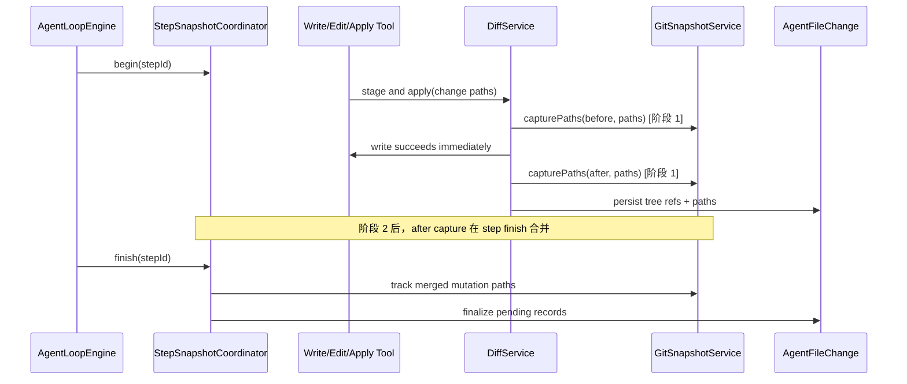

# OpenCode 风格 Tree Snapshot 设计

**日期：** 2026-07-24  
**状态：** 已确认设计，待分阶段实现  
**范围：** `backend` 中 Agent 文件修改、diff、undo 和 Agent step 快照链路

## 1. 目标

将当前“每次 write/edit/apply 都对整个工作区做两次 Git commit 快照”的实现，迁移为 OpenCode 同类的**私有索引 + Git tree object**模型：

1. 写工具的关键路径只做读取、补丁校验和实际文件写入；不再为每个写入创建 Git commit。
2. 文件修改的前后状态用 `git write-tree` 返回的 tree hash 表示；保留已有 `AgentFileChange` 快照字段和 undo/diff API 的兼容性。
3. 优先按本次变更路径增量暂存，避免 `git add -A` 和全仓库 `git status --untracked-files=all`。
4. 将多个变更工具的 after snapshot 合并到 Agent 的 LLM step 完成边界，逐步把昂贵的 Git 工作迁出工具返回路径。
5. 保持三项安全不变量：变更可展示、变更可撤销、异常/取消后仍可恢复或明确失败。

不在本次改造范围内：替换真实 Git 为 JGit、改变用户项目自己的 `.git`、取消现有工作区 lease/权限校验、异步化到无法保证 undo 正确性的程度。

## 2. 已验证的现状与根因

当前 `WriteFileTool -> DiffService.stageAndApplyBatch(...)` 链路为：

```text
准备 diff -> capture(before) -> 写文件 -> capture(after) -> changedFiles/diff -> 落库
```

`GitSnapshotService.capture(...)` 当前每次都会在私有快照仓库中串行执行：

```text
git config user.email
git config user.name
git config core.autocrlf false
git rev-parse --verify HEAD
git add -A
git status --porcelain --untracked-files=all
git commit ... (after 快照)
git rev-parse --verify HEAD
```

一次普通 write 因而会启动约 15 个 Windows Git 子进程，并两次扫描工作区。已采集日志中，实际写文件约 48 ms，before/after 快照分别约 3.6 s / 4.1 s；瓶颈是快照而不是文件 I/O。

## 3. OpenCode 参考实现

在本机 `D:\opencode\opencode-dev` 中确认：

- `packages/opencode/src/tool/write.ts` 与 `tool/edit.ts` 在权限确认后直接写入文件，生成内存 diff，并发送文件/LSP 事件；工具内不调用 snapshot。
- `packages/opencode/src/snapshot/index.ts` 使用工作区外的私有 Git dir；首次初始化时设置 Git 配置，随后不会在每次 track 时重复配置。
- `Snapshot.track()` 通过暂存索引后执行 `git write-tree`，保存 tree hash，不创建 commit。
- 增量候选文件由 `git diff-files --name-only -z` 和 `git ls-files --others --exclude-standard -z` 获得，再以 NUL 分隔 pathspec 进行定向 `git add`。
- 会话 processor 在 step 开始/结束跟踪快照，在 step finish 根据两个 tree 生成 patch；不是在每个 write 工具内同步创建两个快照。
- 其私有 Git dir 对真实 Git 工作区可使用 object alternates/索引 seed，以复用对象；该项需要独立、可回退地实施。

## 4. 目标架构



### 4.1 快照存储

- 继续使用 `<workspace>/.labex/git-snapshots` 私有 bare Git repository；绝不写用户项目的 `.git`。
- `Snapshot.ref` 从 commit hash 迁移为 tree hash；二者都可作为 Git tree-ish 传给 `git diff`、`git cat-file`、`git checkout <tree> -- <path>`，无需立刻改数据库列名。
- `snapshotBeforeRef`、`snapshotAfterRef`、`snapshotPaths`、`snapshotStatus` 维持现有持久化结构，保证历史 commit ref 记录仍可读取。
- 快照仓库初始化配置仅在新建时执行。运行时命令使用传入式 `git -c ...`（如需要），不再写三次持久配置。

### 4.2 阶段 1：兼容的 tree snapshot 与按路径跟踪

`GitSnapshotService` 增加路径范围 API：

```java
Snapshot capture(StudentProject project, String label, Collection<String> relativePaths)
```

- 变更工具将本次通过校验的相对路径传入，而不是调用全局 `git add -A`。
- 对路径使用安全的 NUL/pathspec stdin 或等价的参数传递，不能拼接 shell 字符串。
- 每次 capture 只需要“定向 add + `git write-tree`”；不需要 `status`、`HEAD` 检查或 commit。
- `changedFiles`、`diffForFile`、`restore` 允许 commit/tree 两类 ref；保证已存在历史记录可继续 undo。
- 没有可跟踪路径或 Git 出错时显式返回 unavailable/failed snapshot，不能伪造成功。

阶段 1 保持 write 完成前的 after tree，以最小行为变化换取立刻的 Git 子进程和全仓扫描削减。

### 4.3 阶段 2：Agent step 级 after snapshot

引入 `StepSnapshotCoordinator`（或等价 package-private runtime service）：

- 每个 LLM iteration 取得稳定 `stepId` 与 before tree；首个会修改文件的工具可懒初始化，避免纯读工具触发 Git。
- write/edit/apply 成功后保存变更记录为 `PENDING_STEP`，包含变更路径、内存 diff/hash 和 before ref；工具立即返回。
- iteration/step 的 finally 块统一对去重路径做一次 after track，并 CAS 更新全部 pending change 的 after ref/status。
- 正常完成、模型错误、工具错误、用户取消、引擎终止均必须调用 finalize；若 after track 失败，则记录 `SNAPSHOT_FAILED` 并保留内容 fallback/明确错误，不允许无声丢失。
- 命令工具仍走独立全局快照策略，直到其可写路径能可靠提取；这避免命令的未知副作用被路径快照遗漏。

Agent 当前每轮通常串行执行一个模型工具调用，因此阶段 2 主要降低前端工具返回等待和为将来并行/多工具 step 提供结构；它不以牺牲下一轮上下文正确性为代价。

### 4.4 阶段 3：索引 seed 与对象复用（可选优化）

仅在工作区本身为健康 Git 仓库时：

- 获取 source git common dir。
- 将 source objects 写入 snapshot repo 的 `objects/info/alternates`。
- 在兼容时复制/seed source index；失败后回退为私有空索引。
- 首次初始化启用 OpenCode 同类的 `index.version=4`、`index.threads=true`、`feature.manyFiles=true`、`core.untrackedCache=true`（由实际 Git 版本和测试决定）。

此阶段必须检测 Windows/Git 兼容性、不能修改 source repo 配置或索引，并允许一键退回阶段 1 行为。

## 5. 正确性与恢复不变量

1. **写前状态可定位：** 对每个已经写入的变更，必须保存可用于反向恢复的 before tree 或完整内容 fallback。
2. **按路径恢复：** `restore` 只操作 `snapshotPaths` 内的规范化相对路径；禁止 tree-wide checkout 覆盖用户在其他路径的修改。
3. **并发隔离：** 同一工作区的快照操作继续通过现有 workspace lease/快照锁串行；不同工作区互不阻塞。
4. **异常可见：** Git 子进程超时、输出读取异常、tree 写入失败要携带安全诊断、耗时、标签、路径数量到运行日志，不能吞掉。
5. **历史兼容：** 旧 commit ref 与新 tree ref 均通过 `cat-file`/diff/restore；不可读历史记录应标记不可恢复而不是删除。
6. **内容安全：** 日志只记录路径、数量、hash、耗时和 Git exit code，绝不记录文件正文、密钥或用户命令输出全文。

## 6. 性能预期与可观测性

阶段 1 的单文件 write 从约 15 个 Git 子进程、两次全量扫描，减少为两次“定向 add + write-tree”。初始化配置从热路径移除；`status`、`rev-parse HEAD`、`commit` 从热路径移除。实际收益取决于工作区大小、防病毒扫描和 Git 版本，不能在未基准测试前写死百分比。

新增或保留以下结构化运行日志字段：

- `GIT_SNAPSHOT_INIT_*`：是否首次初始化、耗时；
- `GIT_SNAPSHOT_TRACK_START/COMPLETE/FAILED`：scope（paths/global）、pathCount、stageMs、writeTreeMs、totalMs、ref 前缀；
- `AGENT_STEP_SNAPSHOT_*`：stepId、pendingChangeCount、finalize 原因、耗时；
- `DIFF_APPLY_*`：继续区分 writeMs 与 snapshotMs；
- Git 命令诊断：operation、exit code、wall time、输出长度；不记录敏感内容。

## 7. 不采用的方案

- **写前快照异步化：** 可能在文件已经改变后才得到 before 状态，破坏 undo。
- **完全 fire-and-forget 的 after 快照：** 进程崩溃时会留下不可撤销的已写内容；只能在有持久 pending/finalize 协议后采用。
- **直接用用户项目 Git：** 会污染用户暂存区、hooks、配置和提交历史。
- **立即引入 JGit：** 改动面大，未先消除已有 15 次进程/全仓扫描的结构性浪费。

## 8. 验收标准

1. 单文件 write 的快照链路不再执行 `git commit`、`git status --untracked-files=all` 或每次 `git config`。
2. 变更前后 ref 为可用 tree-ish，单文件 diff、undo、rename/delete 情况均通过测试。
3. 与本次写入无关的新文件不会被路径快照纳入；全局命令快照保持原有覆盖范围。
4. Git 失败、取消和 finalize 失败具有持久状态与安全日志；不会静默报告可 undo。
5. 运行 focused regression、全量后端测试、`mvn -q package -DskipTests`，并在包含真实 Git 的临时工作区输出前后基准数据。